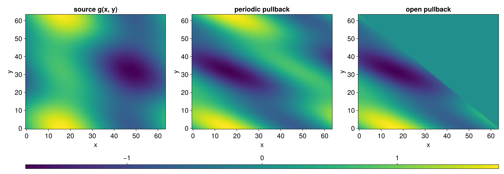
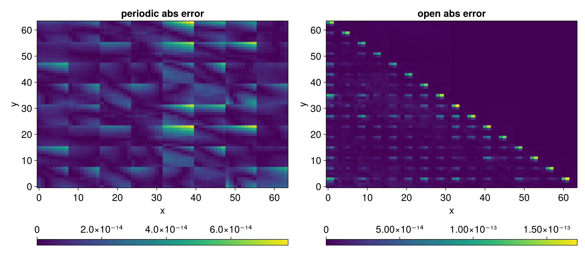
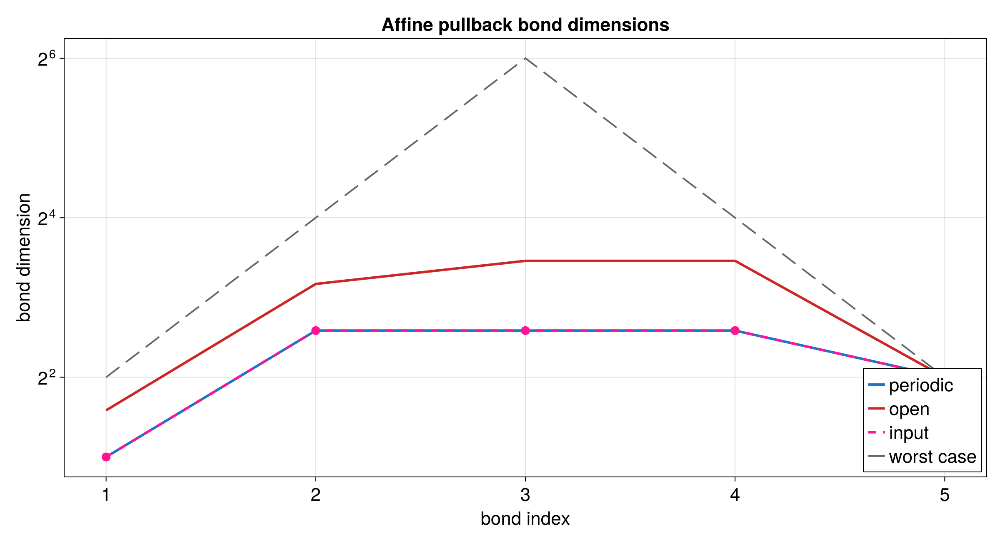
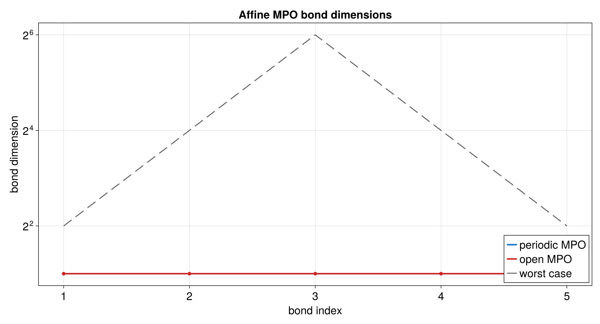

# Affine Transformation

An affine transformation evaluates a function at shifted or mixed coordinates.
The tutorial uses the pullback point of view: to get the new value at an output
point, look up the old function at the transformed input point.

Runnable source: [`docs/tutorial-code/src/bin/qtt_affine.rs`](../../../../tutorial-code/src/bin/qtt_affine.rs)

## Key API Pieces

`AffineParams` stores the matrix and offset. Boundary conditions say what
happens when transformed coordinates leave the grid.

```rust
# fn main() -> anyhow::Result<()> {
# use tensor4all_quanticstransform::{
#     affine_operator, AffineParams, BoundaryCondition,
# };
let bits = 3;
let params = AffineParams::from_integers(
    vec![1, 1, 0, 1],
    vec![0, 0],
    2,
    2,
)?;
let boundary = vec![BoundaryCondition::Periodic; 2];

let operator = affine_operator(bits, &params, &boundary)?;
assert_eq!(operator.mpo.node_count(), bits);
# Ok(())
# }
```

The full tutorial also aligns the operator's site labels with the state before
calling `apply_linear_operator`.

## What It Computes

The example builds a two-dimensional QTT, creates an affine operator, applies
it to the QTT, and compares the transformed values with a direct reference.





The operator has its own bond dimensions, and the transformed QTT has another
set. Both are useful when judging the cost of the operation.




