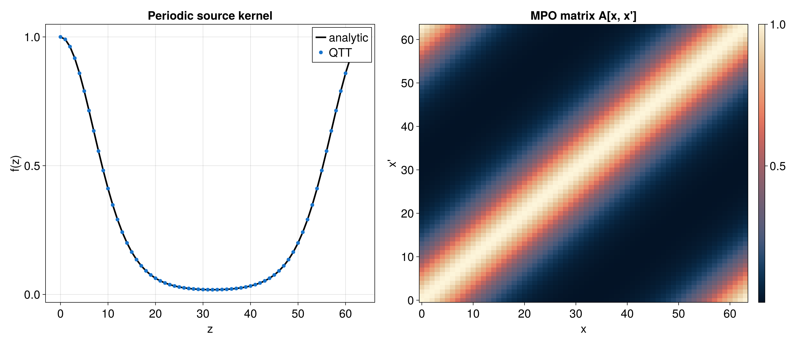
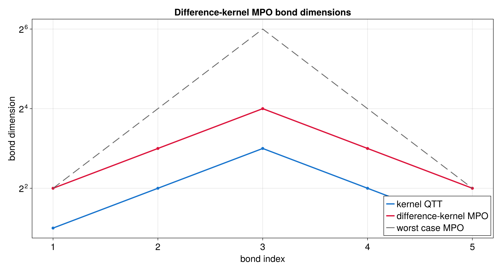

# Difference Kernel MPO

A difference kernel is a matrix whose entries depend only on the coordinate
difference:

```text
A[x, x'] = f(x - x').
```

This tutorial starts from a one-dimensional QTT for `f(z)` and builds the
periodic MPO for `A[x, x'] = f((x - x') mod 2^R)`.

Runnable source: [`docs/tutorial-code/src/bin/qtt_difference_kernel.rs`](../../../../tutorial-code/src/bin/qtt_difference_kernel.rs)

## Key API Pieces

`difference_kernel_mpo` takes a binary QTT over the difference coordinate and
returns an MPO with one fused local index per bit. The local value is encoded as
`x_bit * 2 + xprime_bit`.

```rust
# fn main() -> anyhow::Result<()> {
# use num_complex::Complex64;
# use tensor4all_quanticstransform::{difference_kernel_mpo, BoundaryCondition};
# use tensor4all_simplett::{AbstractTensorTrain, TensorTrain};
let bits = 6;
let site_dims = vec![2; bits];

// A real-valued QTT can be converted to Complex64 before calling the transform.
// This compact example uses a constant kernel QTT.
let f = TensorTrain::constant(&site_dims, Complex64::new(1.0, 0.0));

let mpo = difference_kernel_mpo(&f, BoundaryCondition::Periodic)?;
assert_eq!(mpo.len(), bits);
assert_eq!(mpo.site_dims(), vec![4; bits]);
# Ok(())
# }
```

For `BoundaryCondition::AntiPeriodic`, the same API multiplies entries with
`x < x'` by `-1`. The checked-in tutorial data uses the periodic case only.

## What It Computes

The example builds a smooth periodic source kernel

```text
f(z) = exp(2(cos(2πz/N) - 1))
```

with `N = 2^R`, converts the real QTT cores to `Complex64`, and calls
`difference_kernel_mpo`. The resulting MPO is sampled densely and compared with
the direct reference `f((x - x') mod N)`.




The MPO bonds combine the two-state carry network for `x - x'` with the source
kernel QTT bonds, so the practical bond dimensions are bounded by twice the
kernel QTT bond dimensions before any later compression.


