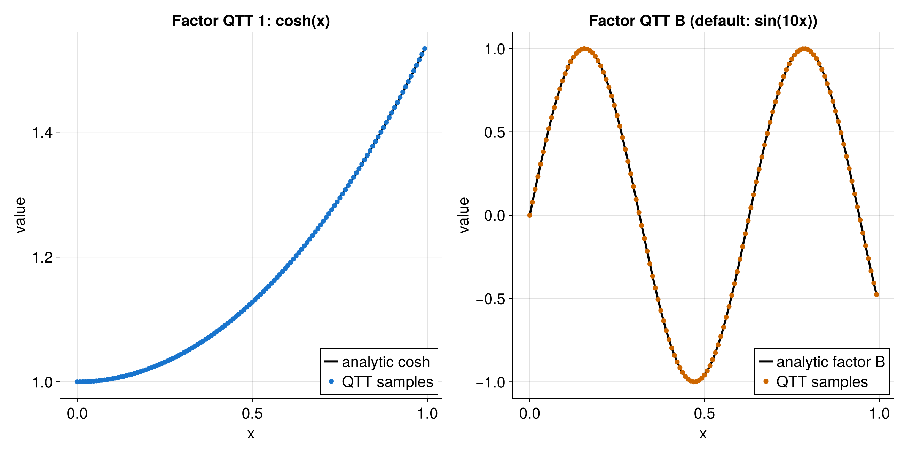
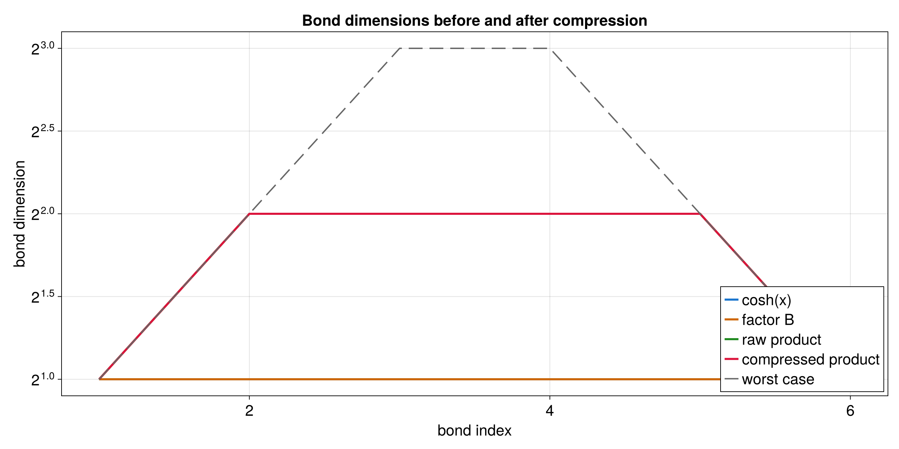

# Elementwise Product

This tutorial multiplies two functions after both have been represented as
QTTs. Elementwise means that values at the same grid point are multiplied:
\(h(x_i) = f(x_i) g(x_i)\).

Runnable source: [`docs/tutorial-code/src/bin/qtt_elementwise_product.rs`](../../../../tutorial-code/src/bin/qtt_elementwise_product.rs)

## What It Computes

The example builds two QTTs, converts them to TreeTN form, pairs matching grid
sites, and contracts those pairs to form the product.




The product may need larger bond dimensions than either factor alone, because
it carries information from both inputs.



## Key API Pieces

The first step is simply to build two QTTs on the same grid. The tutorial
binary then converts their tensor trains to TreeTN and calls
`partial_contract`.

```rust
# fn main() -> anyhow::Result<()> {
# use tensor4all_quanticstci::{quanticscrossinterpolate_discrete, QtciOptions};
let sizes = [8usize];
let options = QtciOptions::default()
    .with_nrandominitpivot(0)
    .with_verbosity(0);
let pivots = vec![vec![1_i64], vec![8]];

let (left, _, _) = quanticscrossinterpolate_discrete::<f64, _>(
    &sizes,
    |idx| idx[0] as f64,
    Some(pivots.clone()),
    options.clone(),
)?;
let (right, _, _) = quanticscrossinterpolate_discrete::<f64, _>(
    &sizes,
    |idx| 2.0 * idx[0] as f64,
    Some(pivots),
    options,
)?;

let i = [4_i64];
assert!((left.evaluate(&i)? * right.evaluate(&i)? - 32.0).abs() < 1e-10);
# Ok(())
# }
```

The important condition is that both QTTs use compatible grids, so that a site
in one QTT refers to the same grid bit as the paired site in the other QTT.
