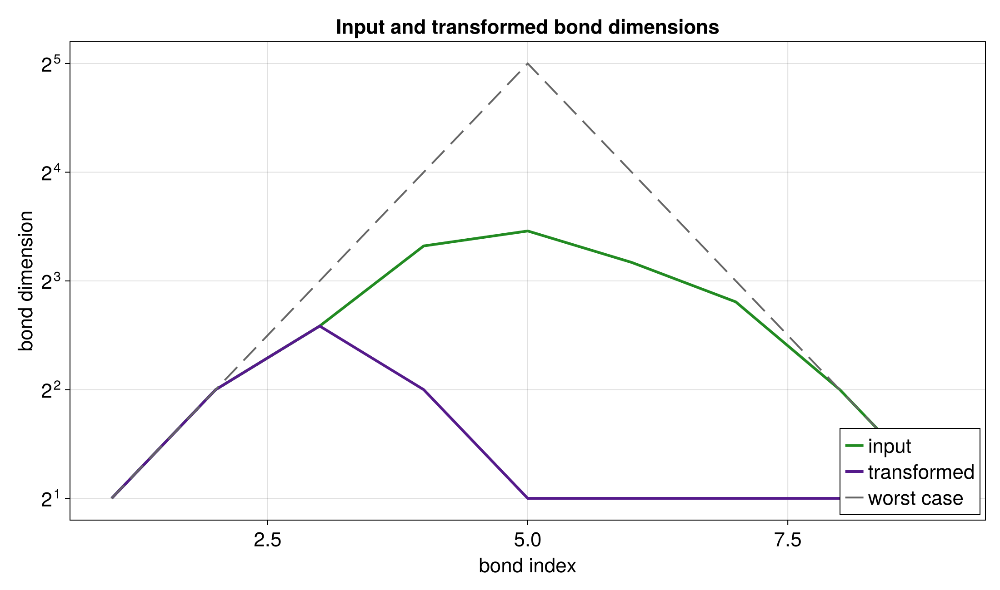
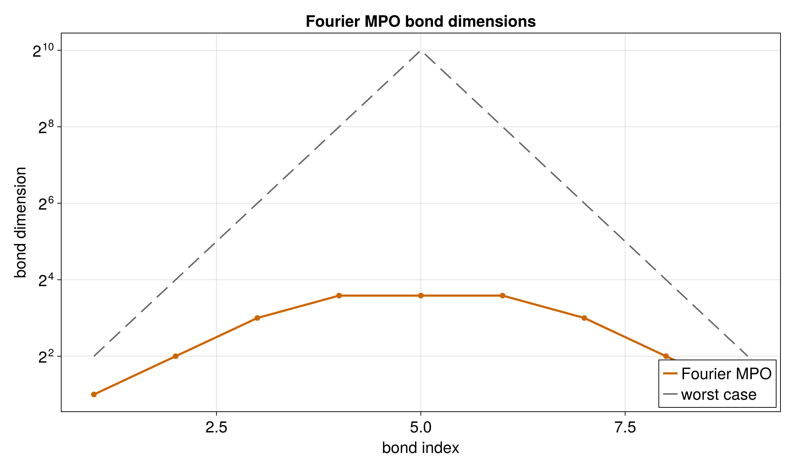

# Fourier Transform

This tutorial applies the quantics Fourier operator to a QTT representation of
a Gaussian. A Gaussian is a helpful first check because its Fourier transform
is also a Gaussian, so the result has a simple reference.

Runnable source: [`docs/tutorial-code/src/bin/qtt_fourier.rs`](../../../../tutorial-code/src/bin/qtt_fourier.rs)

## Key API Pieces

`quantics_fourier_operator` creates the operator. The tutorial binary then
converts the QTT to TreeTN, aligns the site indices, and applies it.

```rust
# fn main() -> anyhow::Result<()> {
# use tensor4all_quanticstransform::{quantics_fourier_operator, FourierOptions};
let bits = 4;
let options = FourierOptions::forward();

let operator = quantics_fourier_operator(bits, options)?;
assert_eq!(operator.mpo.node_count(), bits);
assert_eq!(operator.input_mappings().len(), bits);
# Ok(())
# }
```

The plotted frequency axis is scaled back to physical units, so the curve can
be compared with the analytic Gaussian transform.

## What It Computes

The example builds a QTT for the input Gaussian, applies the Fourier operator,
and compares selected output values with the analytic transform.


The next plots show the bond dimensions for the input QTT and the operator. The
operator dimensions are part of the cost of applying the transform.




