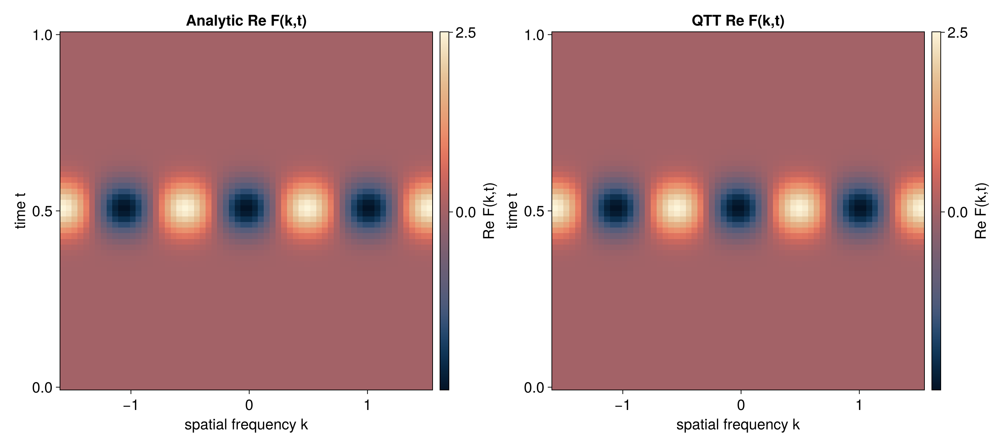
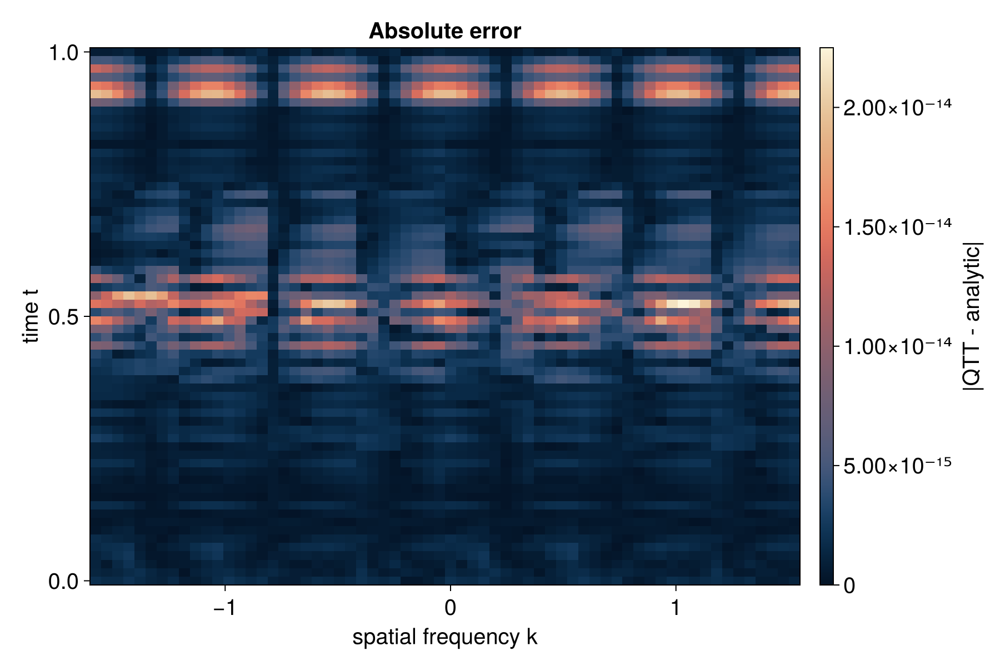
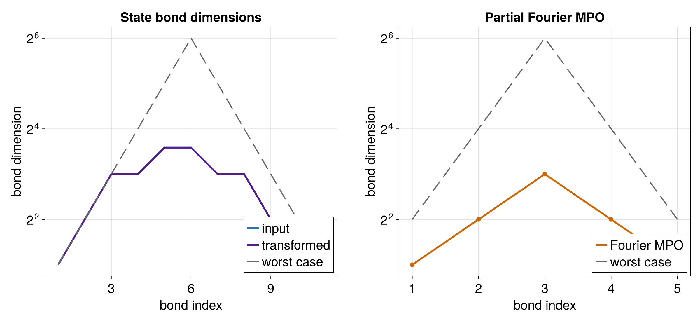

# 2D Partial Fourier Transform

A partial Fourier transform applies Fourier only along one coordinate of a
multivariate function. Here the function is `f(x, t)`, and only the `x`
direction is transformed. The `t` direction passes through unchanged.

Runnable source: [`docs/tutorial-code/src/bin/qtt_partial_fourier2d.rs`](../../../../tutorial-code/src/bin/qtt_partial_fourier2d.rs)

## Key API Pieces

For an interleaved two-variable QTT, x-sites live at positions `0, 2, 4, ...`.
The operator is built for the x-sites only, then applied via
`tensor_train_to_treetn`, `align_to_state`, and `apply_linear_operator`.

```rust
# fn main() -> anyhow::Result<()> {
# use tensor4all_quanticstci::{
#     quanticscrossinterpolate_discrete, QtciOptions, UnfoldingScheme,
# };
# use tensor4all_quanticstransform::{quantics_fourier_operator, FourierOptions};
# use tensor4all_treetn::{apply_linear_operator, tensor_train_to_treetn, ApplyOptions};
let bits = 4;
let sizes = vec![2usize; bits * 2];
let options = QtciOptions::default()
    .with_nrandominitpivot(0)
    .with_verbosity(0);
let pivots = vec![vec![1_i64; bits * 2], vec![2_i64; bits * 2]];

let (state, _, _) = quanticscrossinterpolate_discrete::<f64, _>(
    &sizes,
    |_idx| 1.0,
    Some(pivots),
    options,
)?;

let mut operator = quantics_fourier_operator(bits, FourierOptions::forward())?;
assert_eq!(operator.mpo.node_count(), bits);

let tt = state.tensor_train();
let (state_tn, _indices) = tensor_train_to_treetn(&tt)?;

operator.align_to_state(&state_tn)?;
let result = apply_linear_operator(&operator, &state_tn, ApplyOptions::naive())?;

assert!(result.node_count() > 0);
# Ok(())
# }
```

The tutorial code renames the operator nodes with a site mapping, then applies
the operator while leaving the t-sites in place.

## What It Computes

The example builds an interleaved two-dimensional QTT, applies a one-dimensional
Fourier operator to the x-sites, and compares the result with an analytic
partial transform.





Only the x-sites receive the operator, so the implementation must map the
one-dimensional operator nodes onto the even nodes of the interleaved state.


