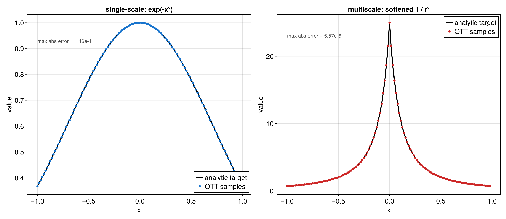
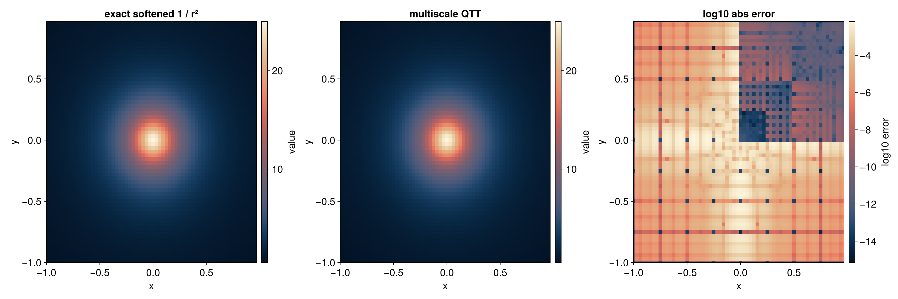
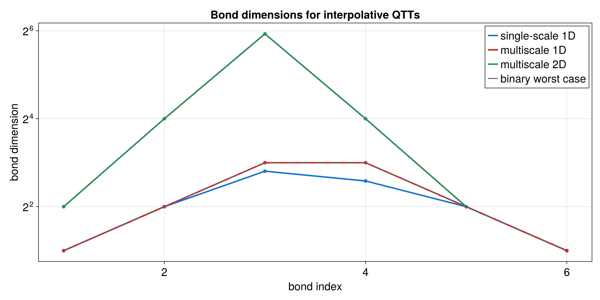

# Interpolative QTT

Interpolative QTT builds a tensor train by sampling a function through local
Chebyshev-Lobatto interpolation. This is useful when the function is already
given on a physical interval and known nonsmooth or sharply localized points
should stay on a multiscale refinement path.

Runnable source: [`docs/tutorial-code/src/bin/interpolative_qtt.rs`](../../../../tutorial-code/src/bin/interpolative_qtt.rs)

## Key API Pieces

Use `interpolate_single_scale` for a smooth one-dimensional function on one
interval. The result is a binary `TensorTrain`, so the site index `[0, 0, ...]`
evaluates the left endpoint of the sampled interval.

```rust
# fn main() -> anyhow::Result<()> {
use tensor4all_interpolativeqtt::{
    interpolate_single_scale, AbstractTensorTrain, InterpolativeQttOptions,
};

let options = InterpolativeQttOptions::default().with_tolerance(1e-12);
let tt = interpolate_single_scale(
    |x| (-x * x).exp(),
    -1.0,
    1.0,
    5,
    12,
    &options,
)?;

let value = tt.evaluate(&[0, 0, 0, 0, 0])?;
assert!((value - (-1.0_f64).exp()).abs() < 1e-10);
# Ok(())
# }
```

Use `interpolate_multi_scale` when a known location should remain refined. The
following target is a finite, softened version of `1 / r^2`; the point `x = 0`
is still the sharp feature.

```rust
# fn main() -> anyhow::Result<()> {
use tensor4all_interpolativeqtt::{
    interpolate_multi_scale, AbstractTensorTrain, InterpolativeQttOptions,
};

let epsilon = 0.2_f64;
let inverse_square = |x: f64| 1.0 / (x.abs() + epsilon).powi(2);
let options = InterpolativeQttOptions::default().with_tolerance(1e-12);
let tt = interpolate_multi_scale(
    inverse_square,
    -1.0,
    1.0,
    5,
    16,
    &[0.0],
    &options,
)?;

let value = tt.evaluate(&[0, 0, 0, 0, 0])?;
assert!((value - inverse_square(-1.0)).abs() < 1e-8);
# Ok(())
# }
```

The multidimensional constructor fuses all variables at the same bit level. For
two variables each site has dimension `4`, corresponding to the two binary
digits at that level.

```rust
# fn main() -> anyhow::Result<()> {
use tensor4all_interpolativeqtt::{
    interpolate_multi_scale_nd, AbstractTensorTrain, InterpolativeQttOptions,
};

let epsilon = 0.2_f64;
let radial_inverse_square = |x: &[f64]| {
    1.0 / (x[0] * x[0] + x[1] * x[1] + epsilon * epsilon)
};
let options = InterpolativeQttOptions::default().with_tolerance(1e-12);
let tt = interpolate_multi_scale_nd(
    radial_inverse_square,
    &[-1.0, -1.0],
    &[1.0, 1.0],
    4,
    8,
    &[vec![0.0, 0.0]],
    &options,
)?;

assert_eq!(tt.site_dims(), vec![4, 4, 4, 4]);
let value = tt.evaluate(&[0, 0, 0, 0])?;
assert!((value - radial_inverse_square(&[-1.0, -1.0])).abs() < 1e-8);
# Ok(())
# }
```

The tutorial binary runs these three constructions and writes CSV output for
the plots below.

## What It Computes

The first example uses single-scale interpolation for `exp(-x^2)`. The second
uses multiscale interpolation for a softened one-dimensional inverse-square
profile, keeping the origin on the refinement path.



The third example uses `interpolate_multi_scale_nd` for a two-dimensional
softened radial inverse-square profile. The error plot uses `log10` absolute
error so both the peak and the background remain visible.



The final plot compares the bond dimensions for all three examples. The
multiscale cases need larger internal spaces near the refined point, and the
two-dimensional fused sites are more expensive than the one-dimensional sites.


