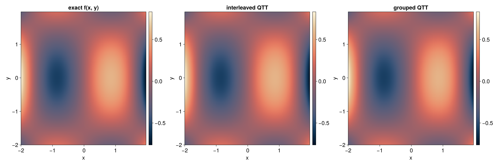
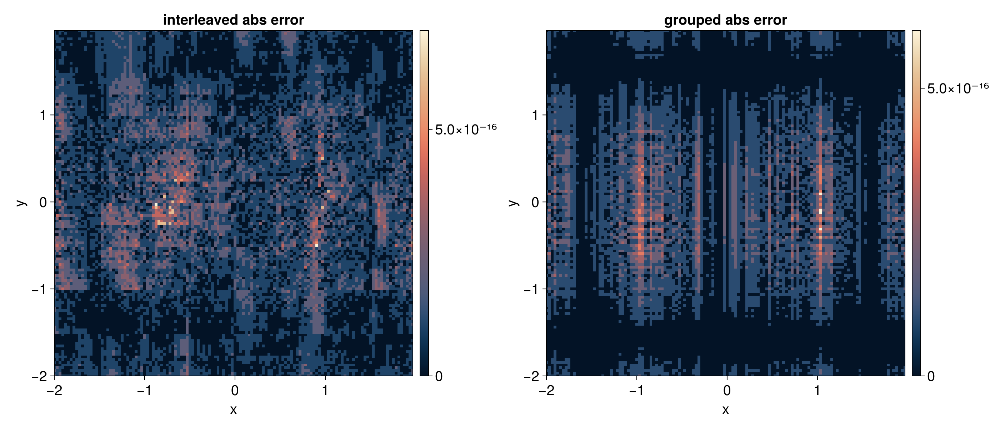
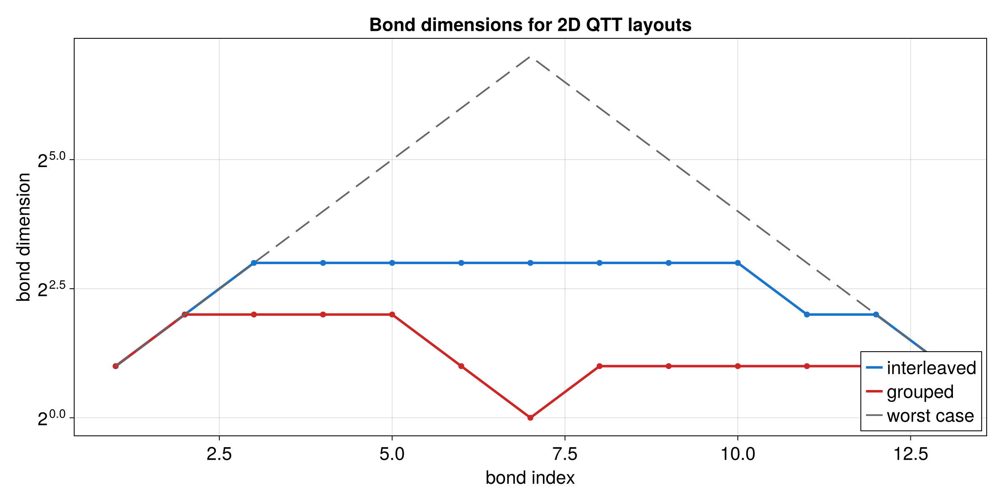

# Multivariate Functions

A multivariate QTT stores a function such as `f(x, y)`. The sites can be
grouped by variable or interleaved. Grouped means all bits for one variable
come first; interleaved means the first bit of each variable appears before the
second bit of each variable. The best choice depends on the function.

Runnable source: [`docs/tutorial-code/src/bin/qtt_multivariate.rs`](../../../../tutorial-code/src/bin/qtt_multivariate.rs)

## Key API Pieces

Use one bit-depth entry per variable when building a `DiscretizedGrid`.

```rust
# fn main() -> anyhow::Result<()> {
# use tensor4all_quanticstci::{
#     quanticscrossinterpolate, DiscretizedGrid, QtciOptions, UnfoldingScheme,
# };
let grid = DiscretizedGrid::builder(&[7, 7])
    .with_variable_names(&["x", "y"])
    .with_bounds(-2.0, 2.0)
    .include_endpoint(false)
    .with_unfolding_scheme(UnfoldingScheme::Interleaved)
    .build()?;

let f = |coords: &[f64]| -> f64 {
    coords[0].cos() * coords[1].cos() * coords[0]
};
let options = QtciOptions::default()
    .with_nrandominitpivot(0)
    .with_unfoldingscheme(UnfoldingScheme::Interleaved)
    .with_verbosity(0);
let pivots = vec![vec![1_i64, 1_i64], vec![128, 128]];
let (qtt, _ranks, _errors) = quanticscrossinterpolate(&grid, f, Some(pivots), options)?;

assert!((qtt.evaluate(&[1, 1])? - f(&[-2.0, -2.0])).abs() < 1e-6);
# Ok(())
# }
```

The tutorial binary builds a QTT for `f(x, y) = x * cos(x) * cos(y)` and compares
the two layouts visually.

## What It Computes

The example builds a two-dimensional QTT with both layouts and compares the
values, errors, and bond dimensions.






