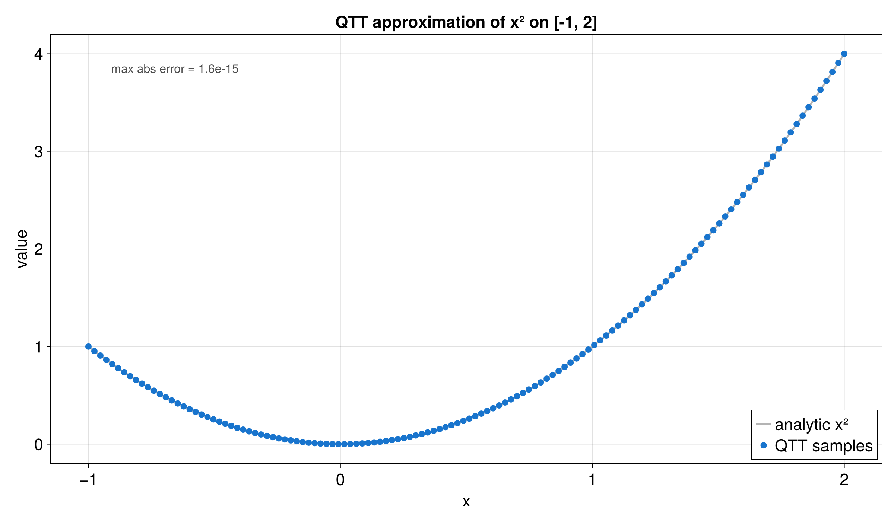

# QTT on a Physical Interval

The previous tutorial used integer grid indices. This one maps those indices to
a real interval, for example `[-1, 2]`. That is useful when the function is
defined as `f(x)`, not as `f(i)`.

Runnable source: [`docs/tutorial-code/src/bin/qtt_interval.rs`](../../../../tutorial-code/src/bin/qtt_interval.rs)

## Key API Pieces

`DiscretizedGrid` owns the mapping from grid index to physical coordinate.

```rust
# fn main() -> anyhow::Result<()> {
# use tensor4all_quanticstci::{
#     quanticscrossinterpolate, DiscretizedGrid, QtciOptions, UnfoldingScheme,
# };
let grid = DiscretizedGrid::builder(&[7])
    .with_lower_bound(&[-1.0])
    .with_upper_bound(&[2.0])
    .include_endpoint(true)
    .with_unfolding_scheme(UnfoldingScheme::Interleaved)
    .build()?;

let f = |coords: &[f64]| -> f64 { coords[0] * coords[0] };
let options = QtciOptions::default()
    .with_nrandominitpivot(0)
    .with_verbosity(0);
let pivots = vec![vec![1_i64], vec![128]];
let (qtt, _ranks, _errors) = quanticscrossinterpolate(&grid, f, Some(pivots), options)?;

assert!((qtt.evaluate(&[128])? - 4.0).abs() < 1e-8);
# Ok(())
# }
```

Indices passed to `evaluate` are one-based grid indices. The grid converts them
to the physical coordinate before the function is sampled.

## What It Computes

The example builds a `DiscretizedGrid`, evaluates the target function on that
grid, and checks that the QTT follows the direct values on the interval.



The bond-dimension plot shows how much information is carried between QTT
sites. For this smooth example, the internal sizes stay modest.


