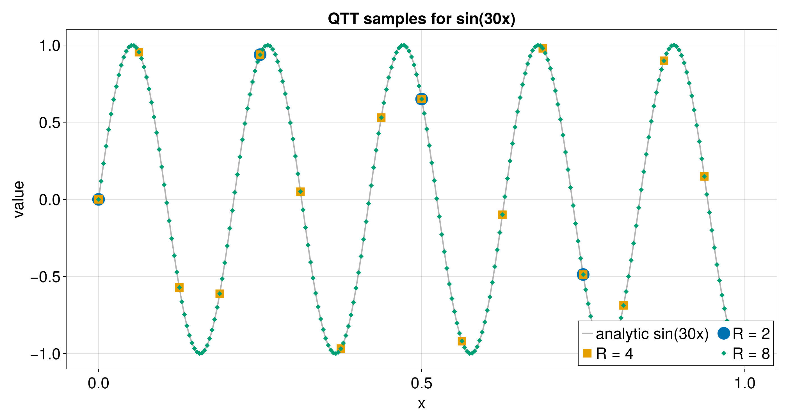
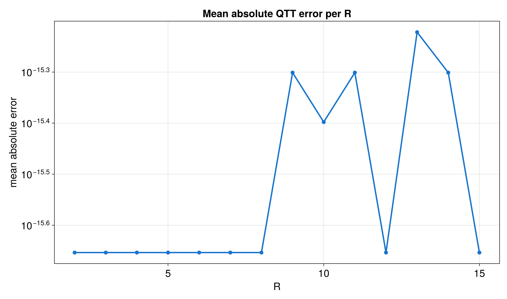
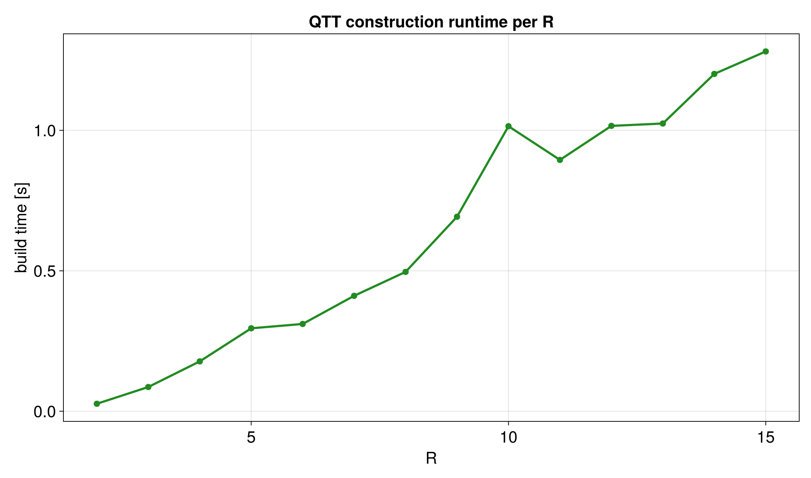

# Sweep over Bit Depth

The bit depth `R` sets the number of grid points: `2^R`. Increasing `R`
usually improves resolution, but it may also increase build time or bond
dimensions.

Runnable source: [`docs/tutorial-code/src/bin/qtt_r_sweep.rs`](../../../../tutorial-code/src/bin/qtt_r_sweep.rs)

## Key API Pieces

The core loop changes only the grid size. The QTCI call stays the same.

```rust
# fn main() -> anyhow::Result<()> {
# use tensor4all_quanticstci::{quanticscrossinterpolate_discrete, QtciOptions};
let mut point_counts = Vec::new();

for bits in [3usize, 4] {
    let size = 1usize << bits;
    let sizes = [size];
    let f = |idx: &[i64]| -> f64 { idx[0] as f64 };
    let options = QtciOptions::default()
        .with_nrandominitpivot(0)
        .with_verbosity(0);
    let pivots = vec![vec![1_i64], vec![size as i64]];
    let (qtt, _ranks, _errors) =
        quanticscrossinterpolate_discrete::<f64, _>(&sizes, f, Some(pivots), options)?;

    assert!((qtt.evaluate(&[size as i64])? - size as f64).abs() < 1e-10);
    point_counts.push(size);
}

assert_eq!(point_counts, vec![8, 16]);
# Ok(())
# }
```

Use sweeps like this when choosing a grid before running a larger computation.

## What It Computes

The example repeats the same QTT construction for several bit depths and writes
the value error, runtime, and sample curves.






