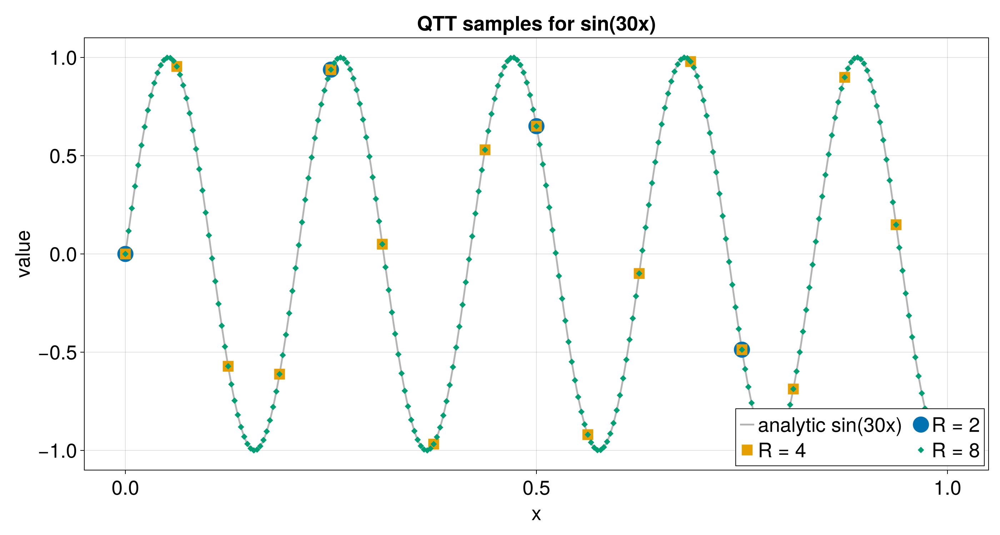
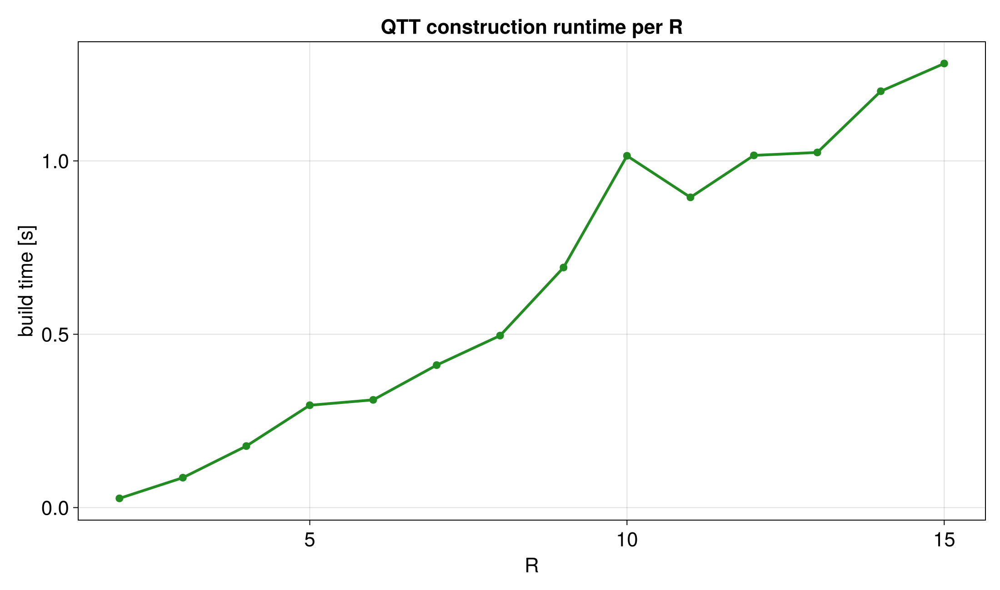

# Sweep over Bit Depth

The bit depth `R` sets the number of grid points: `2^R`. Increasing `R`
usually improves resolution, but it may also increase build time or bond
dimensions.

Runnable source: [`docs/tutorial-code/src/bin/qtt_r_sweep.rs`](../../../../tutorial-code/src/bin/qtt_r_sweep.rs)

## Key API Pieces

The core loop changes only the grid size. The QTCI call stays the same.
The target function is `f(x) = sin(10x)` on the unit interval, with the
zero-based discrete grid index mapped to `x in [0, 1)`.

```rust
# fn main() -> anyhow::Result<()> {
# use tensor4all_quanticstci::{
#     pointwise_index_batch,quanticscrossinterpolate_discrete_batch, QtciOptions};
let mut point_counts = Vec::new();

for bits in [7usize, 8] {
    let size = 1usize << bits;
    let sizes = [size];
    let target_function = |x: f64| -> f64 { (10.0 * x).sin() };
    let f = move |idx: &[usize]| -> f64 {
        let x = idx[0] as f64 / size as f64;
        target_function(x)
    };
    let options = QtciOptions::default()
        .with_verbosity(0);
    let (qtt, _ranks, _errors) =
        quanticscrossinterpolate_discrete_batch::<f64, _>(&sizes, pointwise_index_batch(f), None, options)?;

    let last_grid_index = size - 1;
    let x_last = last_grid_index as f64 / size as f64;
    assert!((qtt.evaluate(&[last_grid_index])? - target_function(x_last)).abs() < 1e-8);
    point_counts.push(size);
}

assert_eq!(point_counts, vec![128, 256]);
# Ok(())
# }
```

Use sweeps like this when choosing a grid before running a larger computation.

## What It Computes

The example repeats the same QTT construction for several bit depths and writes
the value error, runtime, and sample curves.




