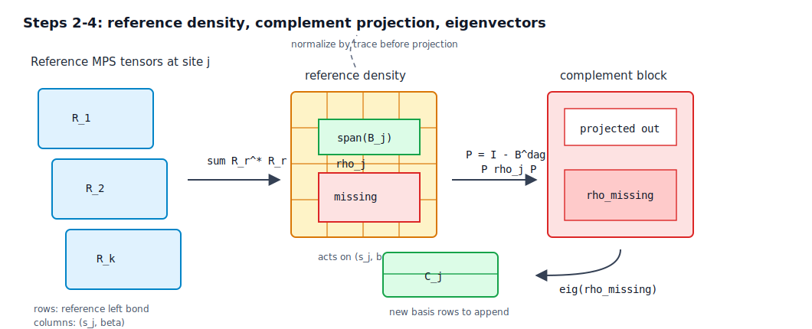
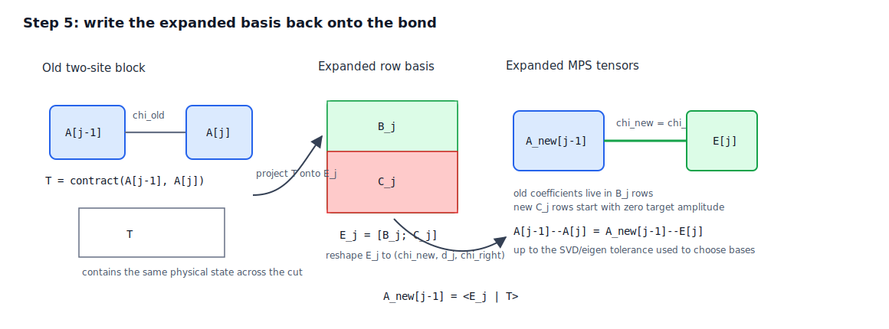

# Chain MPS Global Subspace Expansion

This note explains the chain/MPS global subspace expansion (GSE) algorithm used
by RydbergToolkit.jl before translating it to TreeTN GSE-TDVP.

The goal is not to define the final tensor4all-rs API. The goal is to make the
chain algorithm explicit enough that an MPS reader can see exactly what bond
space is enlarged, why the original state is preserved, and which details are
nontrivial when moving from a chain to a general tree.

## Source Snapshot

This analysis is based on CodingThrust/RydbergToolkit.jl at commit
`9896452ce9f9164f67f761c88b64583aacd72ff9`.

Related tensor4all-rs planning issue:
[#539](https://github.com/tensor4all/tensor4all-rs/issues/539).

Relevant files:

| File | Role |
|---|---|
| [`src/gsetdvp/krylov.jl`](https://github.com/CodingThrust/RydbergToolkit.jl/blob/9896452ce9f9164f67f761c88b64583aacd72ff9/src/gsetdvp/krylov.jl) | Builds the global Krylov reference MPS list. |
| [`src/gsetdvp/expand.jl`](https://github.com/CodingThrust/RydbergToolkit.jl/blob/9896452ce9f9164f67f761c88b64583aacd72ff9/src/gsetdvp/expand.jl) | Expands each MPS bond from the reference states. |
| [`src/gsetdvp/tdvp.jl`](https://github.com/CodingThrust/RydbergToolkit.jl/blob/9896452ce9f9164f67f761c88b64583aacd72ff9/src/gsetdvp/tdvp.jl) | Runs TDVP and inserts GSE between TDVP steps when `krylov_dim > 0`. |
| [`test/gsetdvp/krylov.jl`](https://github.com/CodingThrust/RydbergToolkit.jl/blob/9896452ce9f9164f67f761c88b64583aacd72ff9/test/gsetdvp/krylov.jl) | Compares GSE references and expansion with ITensorMPS. |
| [`test/gsetdvp/expand.jl`](https://github.com/CodingThrust/RydbergToolkit.jl/blob/9896452ce9f9164f67f761c88b64583aacd72ff9/test/gsetdvp/expand.jl) | Checks state preservation, bond growth, and final orthogonality center. |

The source comment in `expand.jl` cites Yang and White, "Time-dependent
variational principle with ancillary Krylov subspace", Phys. Rev. B 102, 094315
(2020).

## Two Different Krylov Uses

There are two Krylov-related pieces that should not be conflated.

1. Local TDVP exponential: TDVP evolves a one-site or two-site local tensor by
   applying `exp(dt H_eff)` in a small effective space. RydbergToolkit can use
   KrylovKit or ExponentialUtilities for this local `expmv`. tensor4all-rs
   already has Hermitian Krylov `expmv` machinery used by the existing TreeTN
   TDVP.
2. Global subspace expansion: GSE builds extra MPS reference states such as
   `H psi`, `H^2 psi`, ... and uses them only to enlarge the variational bond
   spaces before TDVP continues.

This document is about the second item: how the bond basis is enlarged.

## MPS Convention

RydbergToolkit stores an MPS tensor as

`A[j][left_bond, physical, right_bond]`.

For a chain of `N` sites:

```text
A[1] -- A[2] -- ... -- A[j-1] == A[j] -- ... -- A[N]
                         ^
                         bond expanded by the j-th sweep step
```

The expansion sweep canonicalizes the target state and all reference states to
site `N`, then sweeps from `j = N` down to `j = 2`. At the step for site `j`,
the bond between sites `j-1` and `j` is enlarged. Equivalently, the basis for
the right block `j..N` seen across that cut is enlarged.

Write the site tensor as $A^{[j]}_{\alpha s \beta}$, with shape
$(\chi_L, d_j, \chi_R)$. At the $j$ step, combine the physical index $s$ and
the right-block bond $\beta$ into a single column index

$$
x = (s, \beta),
\qquad
M_j[\alpha, x] = A^{[j]}_{\alpha s \beta}.
$$

Thus $M_j$ is a matrix in

$$
M_j \in \mathbb{C}^{\chi_L \times (d_j \chi_R)}.
$$

The rows are labelled by the bond to the unprocessed left block. The columns
are labelled by a local basis for site $j$ together with the already processed
right block $j+1,\ldots,N$.

The SVD of $M_j$ gives the current basis for that column space:

$$
M_j = U_j S_j B_j.
$$

RydbergToolkit's `truncated_svd` helper returns the $V^\dagger$ factor directly,
so this note calls that row-basis matrix $B_j$. Its rows are orthonormal
vectors in $\mathbb{C}^{d_j\chi_R}$:

$$
B_j B_j^\dagger = I,
\qquad
\Pi_j^{\mathrm{old}} = B_j^\dagger B_j.
$$

Here $\Pi_j^{\mathrm{old}}$ is the orthogonal projector onto the right-block
subspace already represented by the current MPS across the cut $(j-1,j)$.

![Reshape A[j] and extract the current row basis](assets/gse-reshape-svd.svg)

## Reference State Generation

`global_krylov_subspace(psi, H; krylovdim)` builds reference states by repeated
MPO application:

| Reference index | State represented by the code |
|---|---|
| `1` | normalized compressed `H psi` |
| `2` | normalized compressed `H (H psi)` |
| `k` | normalized compressed `H^k psi` |

The implementation initializes `cur_reference = psi`, then repeatedly applies
`H` to the current reference. The original `psi` itself is not inserted into
the `references` vector.

Each MPO application uses full compression with `maxdim = maxlinkdim(psi) + 1`
and `atol = 1e-13` by default, then normalizes the result. The `+1` cap is an
important part of this particular implementation: the references are not meant
to be unrestricted high-rank Krylov vectors. They are low-rank probes carrying
directions just outside the current MPS manifold.

Here `maxlinkdim(psi)` is a scalar maximum over the whole MPS, not a vector of
bond-local dimensions. In the Julia source,

$$
\operatorname{maxlinkdim}(\psi)
=
\max_i \max(\dim \chi_{i-1}, \dim \chi_i),
$$

and the same scalar `maxdim` is passed to all SVD/eigen truncations inside
`apply!(FullCompress(), ...)`.

For a Rust translation that aims to match the original Julia strategy, this
should be treated as the default reference-generation policy:

$$
\chi_{\mathrm{ref,max}}
= \max_j \chi_j(\psi) + 1,
\qquad
\epsilon_{\mathrm{ref}} = 10^{-13}.
$$

After each application,

$$
|\widetilde{\Phi}_{m+1}\rangle = H|\Phi_m\rangle,
$$

the temporary state is compressed as

$$
|\Phi_{m+1}\rangle
=
\operatorname{compress}
\left(
|\widetilde{\Phi}_{m+1}\rangle;
\chi_{\mathrm{max}} = \chi_{\mathrm{ref,max}},
\epsilon = \epsilon_{\mathrm{ref}}
\right),
$$

then normalized. This means the reference states are approximate Krylov vectors,
not exact $H^m|\psi\rangle$ vectors and not high-rank MPO-application results.

This point is separate from the later bond expansion. The original algorithm
does not say "add exactly one basis vector per bond." It says "build each
reference with at most one more bond dimension than the current target's maximum
link dimension," then let the projected reference density decide how many
missing local directions pass the eigenvalue tolerance.

Consequently, a compatible Rust API may expose extra safety knobs, but the
compatibility defaults should be:

| Knob | Original-compatible default | Meaning |
|---|---|---|
| `reference_maxdim` | `maxlinkdim(psi) + 1` | Global scalar cap used while building each $H^m\psi$ reference. |
| `reference_atol` | `1e-13` | Absolute SVD/eigenvalue threshold used during reference generation. |
| `expand_atol` | `sqrt(eps(real(T)))`, unless TDVP passes another `atol` | Absolute SVD rank and missing-density eigenvalue threshold in `expand!`. |
| `max_added_per_bond` | none | No explicit cap in `expand.jl`; retained directions are selected by `expand_atol`. |

If tensor4all-rs adds `max_added_per_bond = 1`, that is an extra policy, not the
literal RydbergToolkit default. It may be useful for experiments, but it should
not be the default when checking against the original Julia behavior.

### Tolerance Semantics

The Julia implementation uses the name `atol` literally. The helper
`truncated_svd(M, atol, maxdim)` keeps singular values satisfying

$$
\sigma_i > \mathrm{atol},
$$

and `truncated_eigen(M, atol, maxdim)` keeps eigenvalues satisfying

$$
\lambda_i > \mathrm{atol}.
$$

There is no relative scaling by $\sigma_{\max}$, by matrix dimension, or by
discarded weight in those helper functions. This is the behavior to reproduce
in a strict compatibility mode.

However, this does not mean the clean tensor4all-rs API should expose one
absolute `atol` knob. TreeTN already routes SVD truncation through
`SvdTruncationPolicy`, whose default is
`SvdTruncationPolicy::new(1e-12)`: relative threshold, singular-value measure,
and per-value truncation. In formulas, the default SVD rank rule is

$$
\frac{\sigma_i}{\sigma_{\max}} > 10^{-12}.
$$

That is the right default style for GSE SVDs as well. It is close to a numerical
rank cutoff, matches the rest of TreeTN better than an absolute `atol`, and can
be exposed in user-facing options as `singular_value_cutoff` or directly as an
`SvdTruncationPolicy`.

The preferred Rust design should therefore separate these roles:

| Role | Julia-compatible behavior | TreeTN-aligned default |
|---|---|---|
| Reference compression after $H|\Phi_m\rangle$ | Absolute `reference_atol = 1e-13`, global `reference_maxdim = maxlinkdim(psi) + 1`. | Same global `reference_maxdim`, but use the TreeTN SVD policy default: relative per-value singular-value cutoff `1e-12`. |
| Current-basis rank extraction from $M_j$ | Absolute `expand_atol`, defaulting to `sqrt(eps(real(T)))` in `expand!`. | Use a numerical-rank SVD policy, by default the same relative per-value singular-value cutoff `1e-12`. This step should only remove numerical zeros from the existing target basis. |
| Missing-density eigenvector selection | Absolute $\lambda_i > \mathrm{expand\_atol}$ after trace-normalizing $\rho_j$. | Use a separate `density_weight_cutoff`, defaulting to the same numerical scale such as `1e-12`, because $\operatorname{Tr}\rho_j=1$. |

The last row is not an SVD truncation policy. After trace normalization,

$$
\sum_i \lambda_i = 1,
$$

so the threshold on $\lambda_i$ is already relative to the total reference
weight. It should be named as a density weight cutoff rather than folded into an
SVD `singular_value_cutoff`.

Therefore the recommended implementation shape is:

1. provide a `JuliaCompat` tolerance mode that reproduces the absolute thresholds
   above for regression tests against RydbergToolkit;
2. make the default Rust-facing SVD knobs reuse the existing TreeTN
   `SvdTruncationPolicy` default, exposed as `singular_value_cutoff = 1e-12`
   when a simpler API is desired;
3. keep the missing-density threshold separate as `density_weight_cutoff`.

## Per-Bond Expansion Step

For a fixed site `j`, RydbergToolkit performs the following operations.

### 1. Extract the Current Basis

Before processing site $j$, the target and all reference MPSs have their
orthogonality center at site $j$. Therefore:

- each state's left block $1,\ldots,j-1$ gives an orthonormal basis for that
  state, but the basis may differ between `psi` and the references;
- the already processed right block $j+1,\ldots,N$ is represented in a common
  orthonormal basis for `psi` and all references.

The second point is a sweep invariant. At $j=N$, the right-block basis is the
trivial boundary space, so it is automatically common. After processing site
$j$, the algorithm writes the same expanded right tensor into `psi` and every
reference work buffer, so the block $j,\ldots,N$ becomes the common right-block
basis for the next step $j-1$.

With that invariant, the target state near the cut can be written as

$$
|\psi\rangle
= \sum_{\alpha,x}
M_j[\alpha,x]\,
|L^\psi_\alpha\rangle |x\rangle,
\qquad
x=(s_j,\beta).
$$

Here $|L^\psi_\alpha\rangle$ is an orthonormal left-block basis for the target
state, and $|x\rangle$ is the common basis for "site $j$ plus the processed
right block." Reshaping $A^{[j]}$ into $M_j$ is exactly the extraction of these
coefficients.

Compute a truncated SVD:

$$
M_j = U_j S_j B_j.
$$

The rows of $B_j$ form the current right-block basis for the bond $(j-1,j)$.
With nonzero `atol`, numerically small old directions may be dropped before new
directions are added. To match the Julia implementation, this `atol` should be
the same `expand_atol` used for the missing-density eigenvalue test below,
defaulting to $\sqrt{\epsilon_{\mathrm{mach}}}$ for the real scalar type in
`expand!` and `tdvp`. This is not machine precision itself; it is a user-facing
accuracy/adaptivity tolerance reused for several GSE decisions.

For the TreeTN implementation, prefer the existing SVD policy instead:

$$
\frac{\sigma_i}{\sigma_{\max}} > \tau_{\mathrm{sv}},
\qquad
\tau_{\mathrm{sv}} = 10^{-12}
$$

by default. This is a numerical-rank decision for the current target basis, not
the missing-density selection rule.

### 2. Build a Reference Density Matrix

For each reference MPS $\Phi_r$, reshape its current tensor at site $j$ in the
same way:

$$
R_r[\gamma,x]
= \Phi_r^{[j]}[\gamma,s_j,\beta],
\qquad
x=(s_j,\beta).
$$

The reference state has the cut expansion

$$
|\Phi_r\rangle
=
\sum_{\gamma,x}
R_r[\gamma,x]\,
|L^r_\gamma\rangle |x\rangle.
$$

The left basis $|L^r_\gamma\rangle$ can be different for every reference. It
only needs to be orthonormal for that reference. The right basis $|x\rangle$ is
the same one used for $B_j$, because the sweep has already put the processed
right block into a common basis.

Now trace out the left side of the reference state:

$$
\rho_j^{(r)}
=
\operatorname{Tr}_{L_r}
|\Phi_r\rangle\langle\Phi_r|.
$$

Using $\langle L^r_\delta | L^r_\gamma\rangle=\delta_{\delta\gamma}$, its
matrix elements on the common right-block space are

$$
\rho_j^{(r)}[x,y]
=
\sum_\gamma
\overline{R_r[\gamma,x]}\,R_r[\gamma,y].
$$

Equivalently,

$$
\rho_j^{(r)} = R_r^\dagger R_r.
$$

This is the reduced density matrix of the reference state on the local
right-block space. It measures which directions in the $x=(s_j,\beta)$ space
are important for that reference after ignoring the reference's left
environment.

For multiple references, RydbergToolkit accumulates

$$
\rho_j^{\mathrm{ref}}
=
\sum_r \rho_j^{(r)}
=
\sum_r R_r^\dagger R_r.
$$

RydbergToolkit then normalizes by the trace, when the trace is nonzero:

$$
\rho_j
=
\frac{\rho_j^{\mathrm{ref}}}
{\operatorname{Tr}\rho_j^{\mathrm{ref}}}.
$$

That makes the absolute tolerance less sensitive to the norm and number of
reference states.

### 3. Remove the Already Represented Directions

The density matrix $\rho_j$ includes both directions already represented by the
current target MPS and directions missing from it. The represented subspace is
the row span of $B_j$. With row-basis convention, its projector is

$$
\Pi_j^{\mathrm{old}} = B_j^\dagger B_j.
$$

The intended complement projector is

$$
P_j = I - \Pi_j^{\mathrm{old}}.
$$

The projected density matrix is

$$
\rho_j^{\mathrm{missing}}
=
P_j \rho_j P_j.
$$

This matrix contains only the reference-state weight that cannot already be
represented by the current target bond basis. Since $\rho_j$ is positive
semidefinite and $P_j$ is an orthogonal projector, $\rho_j^{\mathrm{missing}}$
is also positive semidefinite up to numerical roundoff.

Implementation detail: the Julia code stores basis vectors as rows from `Vt`
and forms the projector with `transpose(B_j) * conj(B_j)`. Several nearby
comments in `expand.jl` mark conjugation and index order as items to verify.
With a conventional column-vector bra/ket convention, the row-space projector
would usually be written as `adjoint(B_j) * B_j`. A Rust translation should make
the chosen convention explicit and test complex-valued MPS cases, rather than
copying the expression without checking the bra/ket orientation.

### 4. Diagonalize the Missing Density

If $\|\rho_j^{\mathrm{missing}}\| > \mathrm{atol}$, RydbergToolkit diagonalizes
the Hermitian matrix $\rho_j^{\mathrm{missing}}$:

$$
\rho_j^{\mathrm{missing}} c_\ell = \lambda_\ell c_\ell.
$$

It keeps eigenvectors whose eigenvalues exceed `atol`:

$$
\lambda_\ell > \mathrm{atol}.
$$

These eigenvectors are directions in the same $x=(s_j,\beta)$ space. In the
row-basis convention, collect the retained directions into a matrix $C_j$ whose
rows are the retained missing basis vectors. Then append them to the old basis:

$$
E_j =
\begin{bmatrix}
B_j \\
C_j
\end{bmatrix}.
$$

Since Julia's `eigen` returns eigenvectors as columns, the RydbergToolkit code
transposes them before appending them to the row-basis matrix. In a complex Rust
translation, this is another place where the chosen row-vector convention and
conjugation convention should be made explicit and tested.

If $\rho_j^{\mathrm{missing}}$ is negligible, no new directions are added and
$E_j = B_j$.

The new bond dimension after this step is

$$
\operatorname{rank}(B_j)
+
\#\{\ell : \lambda_\ell > \mathrm{atol}\}.
$$

There is no explicit maximum expansion dimension in `expand.jl`; the only
filter is the eigenvalue tolerance.

Thus the "plus one" in the original implementation belongs to Krylov reference
generation, not to this formula. A single bond often grows only slightly because
the references themselves are low-rank, but if several independent missing
density eigenvectors exceed `atol`, the expansion step can append several rows.



### 5. Replace the Right Tensor and Absorb Coefficients Left

Reshape the expanded basis matrix $E_j$:

```text
E_j -> E_tensor[j] with shape (new_chi_left, d_j, chi_right)
```

Then replace the two tensors around the cut by

```text
old:  A[j-1] -- A[j]
new:  A_new[j-1] -- E_tensor[j]
```

where `A_new[j-1]` is obtained by contracting the old two-site block with the
conjugate expanded basis on site `j` and the right bond.

Conceptually:

```text
two-site block T = contract(A[j-1], A[j])

A_new[j-1][..., ell] = <E_j[ell] | T>
A_new[j]             = E_j
```

After this, the orthogonality center has moved from `j` to `j-1`.



## Why the Target State Is Preserved

The target state is not intentionally changed by GSE. Only its allowed bond
space is enlarged.

Before expansion, the right tensor `A[j]` lies completely in the row span of
$B_j$. Equivalently, there is a coefficient matrix $F_j$ such that

$$
M_j = F_j B_j.
$$

After expansion, $E_j$ contains all rows of $B_j$ plus extra rows from the
projected reference density:

$$
E_j =
\begin{bmatrix}
B_j \\
C_j
\end{bmatrix}.
$$

Therefore the old tensor can be represented in the larger basis exactly, up to
SVD/eigensolver tolerance. If $E_j$ is orthonormal by rows, the expanded
coefficient matrix is

$$
F'_j = M_j E_j^\dagger.
$$

Reconstruction gives

$$
F'_j E_j
=
M_j E_j^\dagger E_j
=
M_j,
$$

because every row of $M_j$ already lies in the row span of $B_j$, and that span
is a subspace of the row span of $E_j$. The new $C_j$ directions have zero
target-state coefficient immediately after expansion.

The left tensor `A_new[j-1]` receives those coefficients. The added basis
vectors therefore create empty variational directions for `psi`; they do not
inject the reference states into `psi` immediately. Subsequent TDVP updates can
then place amplitude in those new directions.

This is why RydbergToolkit tests check that the overlap between the original
and expanded target MPS is approximately one, while the maximum link dimension
increases and the final orthogonality center is site `1`.

## What Happens to Reference States During the Sweep

The reference states are mutable work buffers. At each cut, each reference is
projected into the same expanded basis $E_j$ so that the next cut to the left
can build a density matrix in a compatible gauge.

For the next iteration, the important tensor is the updated
`reference.data[j - 1]`: it contains the reference coefficients in the expanded
right-block basis. In formulas, each reference is rewritten from

$$
|\Phi_r\rangle
=
\sum_{\gamma,x}
R_r[\gamma,x]\,|L^r_\gamma\rangle |x\rangle
$$

to an equivalent representation using the common expanded basis labelled by the
rows of $E_j$. The code also writes a tail tensor at `reference.data[j]`,
but that line is marked with an index-order FIXME. Since the sweep never needs
that already processed tensor again for density construction, a translation
should treat the references as internal moving-center work buffers. If a Rust
API returns expanded references, it should add separate validity tests for
their tensor order and canonical form.

## TDVP Integration in RydbergToolkit

In `tdvp.jl`, GSE is enabled when `krylov_dim > 0`. The implementation:

1. Performs an initial TDVP step.
2. For each later time step, builds global Krylov references from the current
   MPS.
3. Calls `expand!` on the current MPS.
4. Normalizes the expanded MPS if requested.
5. Runs the next TDVP step, rebuilding environments instead of reusing the old
   TDVP cache.

The cache rebuild is essential: every expanded bond changes tensor shapes and
invalidates projected-operator environments.

## Mental Model

GSE is a density-matrix basis-completion sweep.

```text
Current TDVP state psi:

    ... -- A[j-1] == A[j] -- ...
              chi_old

Krylov references H psi, H^2 psi, ... show useful missing directions:

    rho_ref on (site j) x (right block)
       |
       | remove directions already in psi basis
       v
    rho_missing
       |
       | keep dominant eigenvectors
       v
    extra basis rows C_j

Expanded state:

    ... -- A_new[j-1] == E[j] -- ...
              chi_old + chi_extra
```

The state vector represented by `psi` is preserved, but TDVP now has a larger
local tangent/variational space available on later updates.

## Implications for a TreeTN Translation

The chain algorithm has a single natural "right block" at each cut. A TreeTN
translation must replace that with a directed-edge view.

Use a rooted tree with root `r`. For an edge `(p, c)`, let `p` be the endpoint
closer to `r` and `c` the endpoint farther from `r`. The chain analogue is:

```text
root side / unprocessed complement -- bond a=(p,c) -- c-side subtree
```

This orientation matches the chain if the final root is the left end. The GSE
sweep processes edges in postorder, from leaves toward `r`. At the moment edge
`(p,c)` is processed, the whole `c`-side subtree has already been converted into
a common basis for the target state and all reference work buffers.

Let $a$ be the bond index on edge `(p,c)`. Combine the physical index at `c` and
all already processed child-side bond indices incident to `c` into a column
multi-index $q$:

```text
rows:    a = bond index toward the parent
columns: q = physical indices at child plus all child-side bond indices
```

In formulas, the chain reshape

$$
M_j[\alpha,(s_j,\beta)]
=
A^{[j]}_{\alpha s_j \beta}
$$

becomes the directed-edge reshape

$$
M_e[a,q]
=
T^{[c]}_{a,q}.
$$

The same reference-state expansion works if the sweep invariant is generalized:
before processing edge $e=(p,c)$, the target and every reference work buffer have
their orthogonality center at `c`, and every already processed descendant
subtree of `c` is represented in a common orthonormal basis. Then each reference
has a cut expansion

$$
|\Phi_r\rangle
=
\sum_{\gamma,q}
R_{r,e}[\gamma,q]\,
|L^r_\gamma(e)\rangle |q;e\rangle,
$$

and the edge density matrix is

$$
\rho_e^{\mathrm{ref}}
=
\sum_r R_{r,e}^\dagger R_{r,e}.
$$

The old edge basis comes from the row-space SVD of $M_e$; projecting
$\rho_e^{\mathrm{ref}}$ into the complement of that old row span and retaining
dominant eigenvectors enlarges the parent-child bond exactly as in the chain.

### TreeTN Sweep Invariant

The hard part is not the local formula. The hard part is maintaining the common
subtree basis while walking a branching topology.

For a rooted postorder traversal, the invariant before processing edge `(p,c)`
should be:

1. every edge strictly below `c` has already been expanded;
2. the target and all references use compatible bases for those processed
   descendant bonds;
3. the orthogonality center of each work buffer is at `c`;
4. the bond `a=(p,c)` is the only open connection from the processed `c`-side
   subtree to the unprocessed complement;
5. the complement-side basis indexed by `a` is orthonormal for each work buffer,
   so tracing the row index in $R_{r,e}^\dagger R_{r,e}$ is valid.

For chains, this invariant is maintained automatically by the right-to-left
sweep. For a branching TreeTN, a scheduler must move the center between sibling
subtrees without changing already expanded descendant bases. The implementation
should therefore not be a naive loop over unordered edges. It should build an
explicit rooted postorder edge plan, and before each edge, move the target and
all reference work buffers to the required child center `c`.

This suggests an initial TreeTN GSE implementation should share the TDVP root
planning convention but use a different update path:

```text
root r
edge order: postorder directed edges (p, c), c far from r

for (p, c) in edge_order:
    move target and references to center c
    expand bond (p, c) using the c-side density matrix
    write the common expanded c-side basis into each work buffer
    absorb each work buffer's coefficients into p
    mark edge (p, c) orthogonal toward p
```

The final center after the full postorder expansion is the root `r`, matching
the chain behavior where the original right-end-centered MPS finishes with
orthocenter `1`.

Be careful with tuple order. The existing TDVP planner stores postorder edges as
`(child, parent)` because that is convenient for local TDVP updates. This note
uses `(p, c)` for formulas, with `p` closer to the root. A TreeTN GSE
implementation can reuse the same traversal, but it should explicitly rename
planner tuples before applying the formulas.

### Endpoint Update Formula

After the projected-density step, let

$$
E_e[\ell,q]
=
\begin{bmatrix}
B_e \\
C_e
\end{bmatrix}_{\ell,q}
$$

be the expanded row basis for the processed `c`-side space. If
$M_e[a,q] = T^{[c]}_{a,q}$, compute the coefficient tensor

$$
G_e[a,\ell]
=
\sum_q M_e[a,q]\overline{E_e[\ell,q]}.
$$

Then update the two endpoint tensors by

$$
T'^{[c]}_{\ell,q} = E_e[\ell,q],
$$

and

$$
T'^{[p]}_{\ldots,\ell,\ldots}
=
\sum_a
T^{[p]}_{\ldots,a,\ldots}\,
G_e[a,\ell],
$$

where the slot `a` is the old bond index on edge `(p,c)`. The new shared bond
index has dimension `dim(ell)`.

Target preservation requires the old target row span to be retained. The SVD
that extracts $B_e$ may discard numerical zeros, but it must not apply a
reference-compression `maxdim`, a density cutoff, or any policy that truncates
nonzero old target directions in the default state-preserving mode. Such a
lossy mode would be a separate, explicitly named compression step.

The reference work buffers use the same child-side basis but their own
coefficients. For reference $r$, write its local matrix as $R_{r,e}[\gamma,q]$
using the same logical $q$ ordering as above, then compute

$$
G^r_e[\gamma,\ell]
=
\sum_q R_{r,e}[\gamma,q]\overline{E_e[\ell,q]}.
$$

The reference child endpoint is replaced by the same numerical basis $E_e$
renamed onto the reference-local site and child-side bond indices, while the
reference parent endpoint absorbs $G^r_e$. This makes the processed `c`-side
subtree a common basis for the next edge. The target state is preserved because
its old row span is contained in $E_e$; references are only mutable work buffers
and may be projected according to the chosen density cutoff.

In tensor4all-rs this update must go through the TreeTN structural APIs:

1. create a fresh bond index with the expanded dimension;
2. call `TreeTN::replace_edge_bond(edge, new_bond)` before replacing endpoint
   tensors, so `link_index_network`, `site_index_network`, and `ortho_towards`
   stay consistent;
3. replace the endpoint tensors with tensors carrying the new bond index;
4. set `ortho_towards` on `(p,c)` to `p`, because the center has moved from `c`
   toward the root side.

Repeat the same structural update for every reference work buffer, but allocate
buffer-local bond indices rather than reusing the target's `Index` object. The
implementation should keep a logical mapping from target edge `(p,c)` to each
work buffer's corresponding edge index.

This mirrors the existing canonicalization implementation, which updates the
edge bond before replacing tensors during a sweep edge.

### Reference Work Buffers and Index Policy

The references should be treated as internal work buffers, not as user-visible
outputs of the expansion routine. The implementation needs an explicit index
policy:

- The target and reference work buffers should have the same tree topology.
- Site index dimensions must match the target. For the first implementation,
  keep the same v1 TDVP restriction: exactly one state site index per node.
- Reference link IDs should not be assumed to be identical to target link IDs.
  Existing TDVP support deliberately uses `sim_linkinds_mut()` for reference
  states to avoid accidental bra/ket contractions.
- For the local $q$ multi-index, the code should build an explicit
  reference-to-target map covering both the state site index at `c` and every
  processed child-side bond. Current TDVP reference initialization clones the
  target state and then changes link indices, so site indices may be shared by
  construction while link indices differ. The GSE code should still model this
  as a logical-position-and-dimension map, not as raw index-ID equality.
- When forming $R_{r,e}^\dagger R_{r,e}$, use temporary bra/ket copies of the
  local row and column indices so the contraction traces only the row index and
  leaves a density matrix on the target-compatible $q$ space.

This is the same reason `ProjectedOperator` uses stable temporary mappings for
local apply: relying on raw index equality across ket, bra, and operator tensors
is too fragile once multiple TreeTNs participate in one contraction.

### Reference Generation and Topology Compatibility

The reference states $H\psi, H^2\psi,\ldots$ must be generated without hidden
full materialization. They also need to be brought back to the target topology
before GSE. Otherwise there is no well-defined edge `(p,c)` or local $q$ space
shared by the target and the references.

For an initial implementation, require:

1. `apply_linear_operator` or a topology-preserving contraction path produces a
   reference on the same node set and edge set as the target;
2. each reference is compressed with the chosen reference SVD policy and maximum
   bond dimension;
3. each reference is reindexed/restructured to match the target's site-space
   layout, while keeping link IDs collision-safe;
4. after every operator application, explicitly verify site-space compatibility
   with the target, including site index dimensions on each logical node;
5. do not rely on shallow topology helpers that only clone or assume an
   operator preserves site structure without checking the actual output;
6. if topology preservation fails, return an explicit error rather than falling
   back to full dense application.

This keeps the implementation aligned with the repository rule that production
paths must not silently materialize full dense tensors.

### Initial Scope and Validation

The first TreeTN GSE-TDVP implementation should be deliberately narrow:

| Decision | Initial scope |
|---|---|
| State topology | Tree only, same topology for target, references, and operator support. |
| Site space | One state site index per node, matching current TDVP v1. |
| Sweep | Rooted postorder edge expansion ending at the requested TDVP root. |
| Reference generation | Topology-preserving `H` application plus compression; no dense fallback. |
| AD | Preserve tensor payloads where supported; any primal-only basis selection must be explicit. |
| Cache | Fully clear/rebuild TDVP `ProjectedOperator` environments after GSE, or invalidate every node incident to a changed bond. Do not rely on invalidating only the final root. |

Validation should include:

1. chain TreeTN results matching the documented MPS algorithm on small complex
   examples;
2. branching trees where two sibling leaves and at least one high-degree
   internal node are expanded before their parent edge, checking the
   common-basis invariant;
3. overlap/state-distance preservation for the target before and after
   expansion, including a case where the reference cutoff is aggressive enough
   to truncate reference directions but must not truncate the old target basis;
4. link dimension growth only on selected edges, with `link_index_network`,
   `site_index_network`, and `ortho_towards` consistency checks;
5. cache behavior: a TDVP step after GSE must rebuild or invalidate projected
   environments rather than using stale tensors, including reverse-direction
   environment entries;
6. explicit errors for a non-topology-preserving operator application;
7. complex and, if relevant, non-Hermitian reference-generation cases that
   exercise the conjugation convention in $G_e$ and $G^r_e$.

### AD Preservation

TreeTN GSE should preserve AD metadata by default. The local matrices above are
"small" relative to the full tensor network, but converting an AD-tracked tensor
to host values is still a detach. A production implementation should not build
$M_e$, $\rho_e^{\mathrm{ref}}$, or $E_e$ through value-extraction APIs such as
`to_vec`, `into_dense_col_major_parts`, `native_tensor_primal_to_dense_*`, or a
host `Matrix<T>` round trip when the input tensors track gradients.

The preferred shape is:

1. form local reshapes, contractions, projectors, and basis updates as
   `TensorDynLen`/tenferro eager operations so the payload stays in the shared
   AD context;
2. use tenferro-backed `eigh` on the AD-carrying local density tensor, or add a
   tensorbackend wrapper that returns tensor payloads rather than host
   eigenvector buffers;
3. make any intentionally non-differentiable boundary explicit.

This argues for a small, clean `TensorDynLen` linear-algebra wrapper layer before
implementing TreeTN GSE. The GSE implementation should not contain ad hoc
matrix conversions for SVD, QR, or eigendecomposition. Instead, tensor4all-rs
should provide AD-preserving tensor wrappers for the local dense linear algebra
operations it needs:

- SVD on a `TensorDynLen` unfolded by a chosen set of row indices, returning
  `TensorDynLen` factors with the same index semantics as the existing
  factorization path;
- QR on the same tensor-unfolding convention, again returning tensor payloads
  rather than host buffers;
- Hermitian eigendecomposition on a rank-2 `TensorDynLen` density matrix,
  returning eigenvalues and eigenvectors as tensor payloads.

Those wrappers should call tenferro linalg operations on the underlying eager
payload and should preserve tracked AD state whenever tenferro supports the
corresponding AD rule. If a linalg operation or scalar type is not
AD-supported, the wrapper should return an explicit error or document an
explicit detach mode; it should not silently round-trip through primal host
values.

The last point matters because eigenvalue thresholding and rank selection are
piecewise-discrete operations:

$$
C_e = \{c_\ell : \lambda_\ell > \tau_{\mathrm{density}}\}.
$$

In a Julia-compatible mode, $\tau_{\mathrm{density}}$ is the same `atol` passed
to `expand!`. In the preferred Rust-facing API, it should be named as a density
weight cutoff because the density matrix has already been trace-normalized.

If the first implementation chooses to detach the selected expansion basis,
that boundary should be named and documented, for example as "the expansion
basis is selected from primal values." It should still keep the target and
reference tensor contractions after basis selection AD-carrying. Tests should
check that tracked target tensors still report gradient tracking after expansion
unless the API explicitly requested a detached/reference path.

The discrete selection itself is not part of the differentiable map. In other
words, gradients should not be defined through the predicate
$\lambda_\ell > \tau_{\mathrm{density}}$, the number of retained eigenvectors,
or bond dimension changes. The continuous tensor operations before and after
that selection should still preserve AD metadata.

The nontrivial parts are:

| Chain assumption | TreeTN issue |
|---|---|
| There is one left and one right direction. | Every bond needs an explicit orientation relative to a root. |
| Site `j` has columns `(physical, right_bond)`. | A tree node has `(physical indices, all child bonds except parent)`. |
| A right-to-left sweep gives a natural order. | The sweep should follow a postorder over directed edges. |
| Reference density uses one local tensor after the right block is canonical. | The reference work buffers must maintain compatible gauges on all already processed child subtrees. |
| Bond update touches adjacent tensors `j-1` and `j`. | A TreeTN update touches the two endpoint tensors and must replace the shared bond index consistently. |
| TDVP environments are chain arrays. | TreeTN projected-operator caches must invalidate all messages affected by expanded directed edges. |

For issue-level planning, the key implementation target is therefore not "add
KrylovKit". It is an edge-oriented TreeTN basis-expansion primitive that:

1. builds low-rank reference states such as `H psi`, `H^2 psi`, ... without
   hidden full materialization;
2. sweeps directed edges in a canonical gauge;
3. computes projected reference density matrices on local child-side spaces;
4. expands shared bond indices while preserving the target state;
5. updates reference work buffers consistently enough for the next edge; and
6. preserves AD metadata except at explicitly named nondifferentiable selection
   boundaries;
7. hands the expanded state to the existing TreeTN TDVP with invalidated
   environments.
