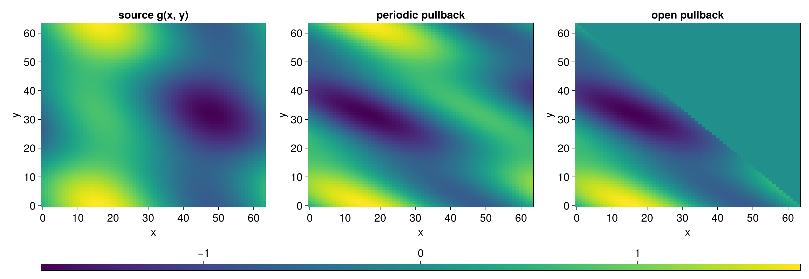
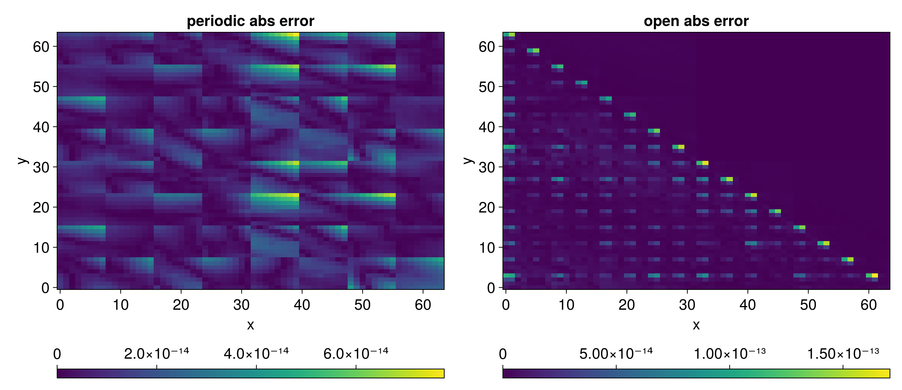
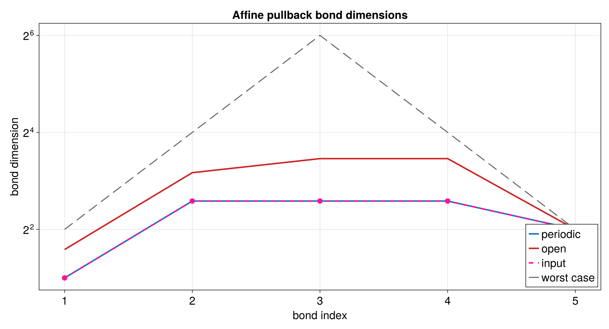
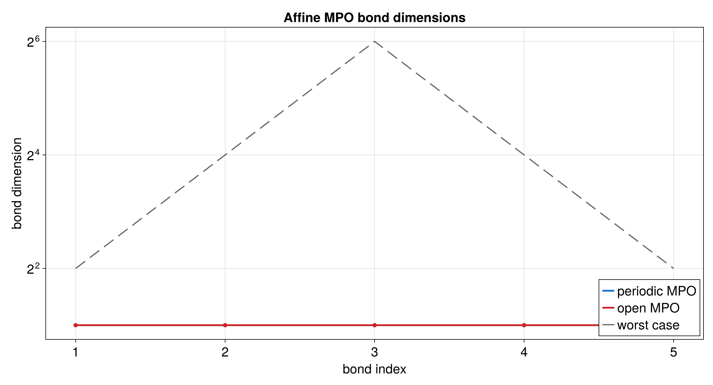

# QTT affine transformation with `tensor4all-rs`

This tutorial applies a two-dimensional affine pullback to a QTT with
`tensor4all-rs`.

The example starts with a source function `g(u, v)` and builds the transformed
function

```text
f(x, y) = g(x + y, y).
```

The source tensor stores values of `g(u, v)`. The tutorial wants the new field
`f(x, y)`, so it uses the passive pullback: for each output coordinate
`(x, y)`, the code samples the source at the transformed coordinates
`(u, v) = (x + y, y)`. In the library, that pullback is obtained by transposing
the forward affine operator.

## Files in this example

- [`src/qtt_affine_common.rs`](../../src/qtt_affine_common.rs)
- [`src/bin/qtt_affine.rs`](../../src/bin/qtt_affine.rs)
- [`docs/plotting/qtt_affine_plot.jl`](../plotting/qtt_affine_plot.jl)
- [`docs/data/qtt_affine_samples.csv`](../data/qtt_affine_samples.csv)
- [`docs/data/qtt_affine_bond_dims.csv`](../data/qtt_affine_bond_dims.csv)
- [`docs/data/qtt_affine_operator_bond_dims.csv`](../data/qtt_affine_operator_bond_dims.csv)

## Figures at a glance









## What the example computes

The source function is

```text
g(u, v) =
    sin(2πu/N)
  + 0.5 cos(2πv/N)
  + 0.25 sin(2π(u + 2v)/N).
```

The affine map used for lookup is

```text
[u]   [1 1] [x]   [0]
[v] = [0 1] [y] + [0].
```

For periodic boundary conditions, the reference wraps:

```text
u = (x + y) mod N
v = y
f_periodic(x, y) = g(u, v)
```

For open boundary conditions, the reference is zero outside the finite grid:

```text
if x + y >= N:
    f_open(x, y) = 0
else:
    f_open(x, y) = g(x + y, y)
```

The open-boundary result becomes zero along the triangular region where
`x + y` leaves the grid. The affine lookup asks the source tensor for
`u = x + y`, but valid source indices are only `0, ..., N - 1`. With open
boundary conditions, out-of-domain source coordinates are discarded instead of
wrapped, so every target point with `x + y >= N` evaluates to zero.

The checked-in run uses `bits = 6`, so `N = 64` and the dense comparison has
`64 * 64` sample points. That is enough for this low-frequency tutorial example
to show the wraparound and open-boundary triangle clearly. It is a display
default, not a general convergence rule for affine transformations.

## Why the fused quantics layout appears here

The affine operator works on fused two-dimensional quantics sites. Each site
stores one bit from each coordinate at the same scale.

For one site,

```text
site_value = x_bit | (y_bit << 1).
```

The source QTT is built with `UnfoldingScheme::Fused`, so the source function
can still be written naturally as a function of two grid coordinates. When the
transformed `TreeTN` is sampled, the code uses the library grid conversion
`InherentDiscreteGrid::grididx_to_quantics` to turn `(x, y)` into fused site
values.

## Important Rust API pieces

The affine matrix is created with `AffineParams`:

```rust
let params = AffineParams::from_integers(
    vec![1, 0, 1, 1],
    vec![0, 0],
    2,
    2,
)?;
```

The matrix entries are column-major, so this is

```text
[1 1]
[0 1]
```

The tutorial applies the pullback, not the forward affine operator, because it
starts from a source function `g(u, v)` and defines each new value by sampling
`g` at transformed coordinates. In `tensor4all-rs`, the forward operator maps
coordinates as `y = A*x + b`; its transpose is the pullback
`f(y) = g(A*y + b)`.

```rust
let operator = affine_operator(bits, &params, &boundary_conditions)?.transpose();
```

The boundary mode is chosen with:

```rust
vec![BoundaryCondition::Periodic; 2]
vec![BoundaryCondition::Open; 2]
```

After the source QTT is converted to `TreeTN`, the code aligns the affine
operator to the state's site indices with `align_to_state`, then applies it
with:

```rust
let mut aligned_operator = operator.clone();
aligned_operator.align_to_state(&state)?;
apply_linear_operator(&aligned_operator, &state, ApplyOptions::naive())?
```

## How to read the plots

The value plot compares the original source field, the periodic pullback, and
the open pullback on one color scale. The periodic result is a sheared and
wrapped version of the source. The open result has a triangular zero region
where `x + y >= N`.

The error plot compares the transformed QTT against the analytic discrete
reference. The values should be near the QTCI tolerance.

The bond-dimension plots show how much rank growth comes from applying the
affine pullback, and how large the periodic and open affine MPOs are.

## Running the workflow

From the repository root:

```bash
cargo run --bin qtt_affine --offline
julia --project=docs/plotting docs/plotting/qtt_affine_plot.jl
```

To run only the affine tutorial tests:

```bash
cargo test --offline qtt_affine -- --nocapture
```
