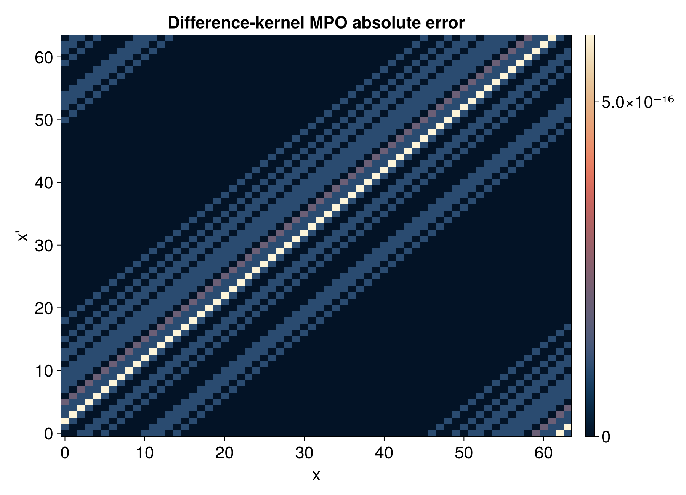

# QTT difference-kernel MPO with `tensor4all-rs`

This tutorial constructs a matrix product operator for a one-dimensional
difference kernel:

```text
A[x, x'] = f(x - x').
```

The checked-in example uses periodic boundaries, so the actual discrete
reference is

```text
A[x, x'] = f((x - x') mod N),    N = 2^R.
```

## Files in this example

- [`src/qtt_difference_kernel_common.rs`](../../src/qtt_difference_kernel_common.rs)
- [`src/bin/qtt_difference_kernel.rs`](../../src/bin/qtt_difference_kernel.rs)
- [`docs/plotting/qtt_difference_kernel_plot.jl`](../plotting/qtt_difference_kernel_plot.jl)
- [`docs/data/qtt_difference_kernel_samples.csv`](../data/qtt_difference_kernel_samples.csv)
- [`docs/data/qtt_difference_kernel_bond_dims.csv`](../data/qtt_difference_kernel_bond_dims.csv)

## Figures at a glance





## What the example computes

The source kernel is the smooth periodic function

```text
f(z) = exp(2(cos(2πz/N) - 1)).
```

The Rust binary first builds a one-dimensional QTT for `f(z)` with
`quanticscrossinterpolate_discrete`. The difference-kernel transform then
combines this kernel QTT with the delta network for

```text
z = x - x'  mod N.
```

The resulting MPO stores one fused local index per bit:

```text
site_value = x_bit * 2 + xprime_bit.
```

Sampling the MPO at all `(x, x')` gives a circulant dense matrix. Each row is a
cyclic shift of the source kernel profile.

## Important Rust API pieces

The transform API is:

```rust
let mpo = difference_kernel_mpo(&kernel_qtt_complex, BoundaryCondition::Periodic)?;
```

The input kernel must be a binary QTT with `Complex64` scalar type. The tutorial
builds the source kernel as a real QTT, then maps each core entry to
`Complex64` before calling `difference_kernel_mpo`.

The periodic boundary condition gives `z = (x - x') mod N`. The API also
accepts `BoundaryCondition::AntiPeriodic`; in that mode, entries with `x < x'`
are multiplied by `-1`. Open boundaries are intentionally rejected for this
operation.

## How to read the plots

The value plot shows the source profile `f(z)` and the dense matrix represented
by the MPO. The diagonal bands reflect the periodic difference
`(x - x') mod N`.

The error plot compares every sampled MPO entry against the direct periodic
reference. Values should be close to the QTCI tolerance.

The bond-dimension plot compares the source kernel QTT bonds with the
difference-kernel MPO bonds. The MPO combines the source QTT bond with the
two-state carry network used for subtraction, so the uncompressed construction
has at most twice the source bond dimension.

## Running the workflow

From the repository root:

```bash
cargo run --bin qtt_difference_kernel --offline
julia --project=docs/plotting docs/plotting/qtt_difference_kernel_plot.jl
```

To run only the difference-kernel tutorial tests:

```bash
cargo test --offline qtt_difference_kernel -- --nocapture
```
