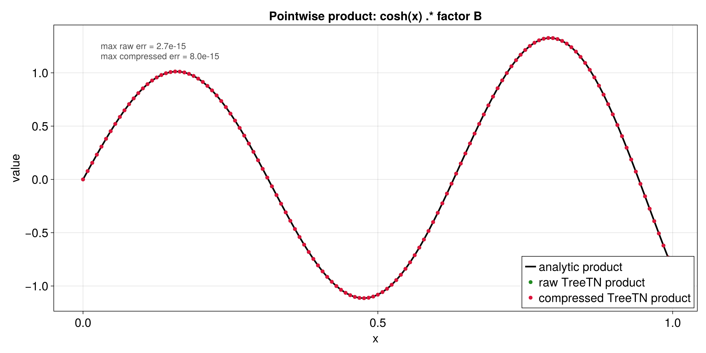

# Elementwise TreeTN product for `cosh(x)` and a second factor

This example shows how to combine two function-to-QTT constructions and how
to multiply the resulting tensor trains pointwise.

The workflow is split into two parts:

1. **Rust** builds the QTTs, converts them to TreeTN, multiplies them with
   `partial_contract(...)`, and exports CSV data.
2. **Julia + CairoMakie** reads the CSV files and creates the plots.

That split keeps the Rust code focused on the tensor logic and keeps plotting
code out of Rust.

## Files in this example

The Rust side lives in:

- [`src/bin/qtt_elementwise_product.rs`](../../src/bin/qtt_elementwise_product.rs)
- [`src/qtt_elementwise_product_utils.rs`](../../src/qtt_elementwise_product_utils.rs)

The Julia plotting script lives in:

- [`docs/plotting/qtt_elementwise_product_plot.jl`](../plotting/qtt_elementwise_product_plot.jl)

The generated data and plots live in:

- [`docs/data/qtt_elementwise_product_samples.csv`](../data/qtt_elementwise_product_samples.csv)
- [`docs/data/qtt_elementwise_product_bond_dims.csv`](../data/qtt_elementwise_product_bond_dims.csv)
- [`docs/plots/qtt_elementwise_product_factors.png`](../plots/qtt_elementwise_product_factors.png)
- [`docs/plots/qtt_elementwise_product_factors.png`](../plots/qtt_elementwise_product_factors.png)
- [`docs/plots/qtt_elementwise_product_product.png`](../plots/qtt_elementwise_product_product.png)
- [`docs/plots/qtt_elementwise_product_product.png`](../plots/qtt_elementwise_product_product.png)
- [`docs/plots/qtt_elementwise_product_bond_dims.png`](../plots/qtt_elementwise_product_bond_dims.png)
- [`docs/plots/qtt_elementwise_product_bond_dims.png`](../plots/qtt_elementwise_product_bond_dims.png)

## Figures at a glance

### Factor plots


This figure shows the two factor functions separately. The analytic curves are
drawn first and the QTT samples are laid on top, so it is easy to see how
closely each QTT matches its target function.

### Product plot



This figure compares the analytic product with the raw TreeTN product and the
compressed TreeTN product. It is the main correctness check for the
elementwise-multiplication pipeline.

### Bond-dimension plot


This figure compares the bond-dimension profiles of the two factor QTTs and of
the product before and after truncation. It is useful for seeing how much
complexity the multiplication introduces.

## What this example computes

The two factor functions are:

```text
f(x) = cosh(x)
g(x) = factor_b_function(x)
```

In the default demo, `factor_b_function(x)` is implemented as `sin(10x)`,
but the code uses a generic name so you can swap in other functions later
without rewriting the whole tutorial.

The target product is therefore:

```text
h(x) = cosh(x) * factor_b_function(x)
```

The Rust program builds a QTT approximation for both factors on the same
discrete grid. It then converts the two tensor trains to `TreeTN` and uses the
public `tensor4all_treetn::partial_contract(...)` API with `diagonal_pairs`
to form the pointwise product. That public API is the important update here:
the design notes also mention `multiply_pairs`, but the code you can call today
exposes the diagonal/copy semantics directly through `PartialContractionSpec`.

```text
C_k[i_k] = A_k[i_k] ⊗ B_k[i_k]
```

Because the TreeTN API now exposes this path publicly, there is no need for a
local pointwise-product helper in the demo.

The raw product TreeTN is then truncated again to reduce bond growth.

## Why this is a useful experiment

This example shows three different stages:

1. a QTT approximation of `cosh(x)`
2. a QTT approximation of the second factor function
3. the pointwise product of those two QTTs via TreeTN

That makes it a good starting point if you want to study how tensor-train
bond dimensions behave under multiplication.

## Why the code is split into two Rust files

The main binary, [`src/bin/qtt_elementwise_product.rs`](../../src/bin/qtt_elementwise_product.rs),
contains only the core algorithmic logic:

- build the two QTTs
- convert the QTTs to TreeTN
- form the pointwise product with `partial_contract(...)`
- truncate the result

The helper file, [`src/qtt_elementwise_product_utils.rs`](../../src/qtt_elementwise_product_utils.rs),
contains support code:

- sample collection
- terminal summaries
- CSV export
- bond-dimension bookkeeping

This separation keeps the main binary much easier to read.

## Important Rust API pieces

The most useful way to read this example is to follow the API calls in the
same order as the program does.

### High-level call order

The Rust side follows this rough sequence:

1. define the two target functions
2. build a QTT for each function with `quanticscrossinterpolate_discrete(...)`
3. extract the underlying `TensorTrain` with `tensor_train()`
4. convert both tensor trains to `TreeTN` with `tensor_train_to_treetn()`
5. build a `PartialContractionSpec` with `diagonal_pairs`
6. call `partial_contract(...)` to form the exact product TreeTN
7. truncate the product with `TreeTN::truncate(...)`
8. sample all grid points again with `evaluate(...)` on the factor QTTs and `evaluate_at(...)` on the product TreeTNs
9. collect bond dimensions with `link_dims()` on the factors and `tree_link_dims()` on the product
10. write CSV files
11. let Julia/CairoMakie plot the CSV data

### Pseudocode view

This is the same workflow in a more compact pseudocode style:

```text
function f(x) = cosh(x)
function g(x) = factor_b_function(x)

qtci_f = quanticscrossinterpolate_discrete(grid, callback_for_f, options)
qtci_g = quanticscrossinterpolate_discrete(grid, callback_for_g, options)

tt_f = qtci_f.tensor_train()
tt_g = qtci_g.tensor_train()

tree_f, site_ids_f = tensor_train_to_treetn(tt_f)
tree_g, site_ids_g = tensor_train_to_treetn(tt_g)

spec = PartialContractionSpec {
    contract_pairs: [],
    diagonal_pairs: zip(site_ids_f, site_ids_g),
    output_order: site_ids_f,
}

tree_product_raw = partial_contract(tree_f, tree_g, spec)
tree_product_compressed = truncate(tree_product_raw)

samples = collect_samples(qtci_f, qtci_g, tree_product_raw, tree_product_compressed)
bond_profile = collect_bond_profile(tt_f, tt_g, tree_product_raw, tree_product_compressed)

write_samples_csv(samples)
write_bond_dims_csv(bond_profile)

plot_with_julia(samples, bond_profile)
```

### What each Rust function does

### `quanticscrossinterpolate_discrete`

This is the main constructor for a QTT from a discrete callback.

It takes:

- the discrete grid size
- a function callback of type `Fn(&[i64]) -> f64`
- optional starting pivots
- interpolation options

It returns:

- the quantics tensor interpolation object
- a rank history
- an error history

In this example the callback is a closure that converts a 1-based discrete
index into `x in [0, 1)` and then evaluates the target function.

### `tensor_train()`

This extracts the underlying `TensorTrain<f64>` from the quantics object.

That is the object we use for TT-level inspection and as the input to
`tensor_train_to_treetn(...)`.

Inputs:

- a `QuanticsTensorCI2<f64>`

Output:

- a `TensorTrain<f64>`

### `tensor_train_to_treetn(...)`

This converts the factor QTTs from the `simplett` tensor-train format into
`TreeTN`.

Inputs:

- a `TensorTrain<f64>`

Outputs:

- a `TreeTN<TensorDynLen, usize>`
- the corresponding site indices, which are reused later for pairing and
  evaluation

### `PartialContractionSpec` and `partial_contract(...)`

This is the new public TreeTN API that performs the product.

Inputs:

- two `TreeTN` values
- a `PartialContractionSpec`
- a center node name
- `ContractionOptions`

The spec in this example uses:

- `contract_pairs: []`
- `diagonal_pairs: [...]` for every site index pair
- `output_order: Some(...)` so the surviving site indices stay in a predictable
  order

Important detail:

- the design docs mention `multiply_pairs`, but the implemented public API
  currently uses `diagonal_pairs` for the pointwise product semantics

Output:

- the exact TreeTN product

### `TreeTN::truncate(...)`

This reduces bond dimensions after the exact product has been formed.

Inputs:

- the raw product TreeTN
- a single center node
- `TruncationOptions` with tolerance and max-rank settings

Output:

- a truncated TreeTN with smaller bond dimensions

### `collect_samples(...)`

This helper re-evaluates the factor QTTs and the TreeTN product on every grid
point and stores both the analytic values and the reconstructed values.

Inputs:

- both factor QTT objects
- the raw product TreeTN
- the compressed product TreeTN
- the site indices of the product TreeTN
- the number of bits / points
- the two analytic Rust functions

Output:

- a vector of sample rows ready for CSV export

This is the function that makes the plots possible later on.

### `collect_bond_profile(...)`

This helper reads `link_dims()` from the factor TTs and uses the TreeTN edge
structure for the product.

Inputs:

- the factor tensor trains
- the raw product TreeTN
- the compressed product TreeTN

Output:

- a vector of bond-profile rows

### `tree_link_dims(...)`

This helper walks the TreeTN edges and collects the bond dimensions in order.

Inputs:

- a TreeTN

Output:

- a list of bond dimensions

### `evaluate_at(...)`

This is the TreeTN evaluation method used to read the product back.

Inputs:

- the site indices as `DynIndex` objects
- a column-major matrix of site values

Output:

- the evaluated scalar values for the requested grid points

### `write_samples_csv(...)` and `write_bond_dims_csv(...)`

These functions take the collected tables and write them to disk.

Inputs:

- a path
- a vector of rows

Output:

- a CSV file on disk

Side effect:

- they print the file path after successful writing, so `main()` stays clean

### `site_tensor(...)`, `site_dims()`, `link_dims()`

These are the most useful inspection methods when you want to see the internal
TT structure.

- `site_dims()` tells you the physical size of each site
- `link_dims()` tells you the bond dimensions between sites
- `site_tensor(i)` exposes the individual core tensors

## Why the TreeTN product is exact here

The pointwise product is represented exactly by the TreeTN partial contraction
path used in this example:

1. convert both tensor trains to `TreeTN`
2. pair each physical site index from the first factor with the matching site
   index from the second factor via `diagonal_pairs`
3. contract the combined network
4. truncate the resulting TreeTN if you want a smaller bond profile

This is the same basic diagonal/copy idea that often appears in Julia-style
tensor-network code. The important difference is that here we use the public
Rust API directly instead of a local helper.

## How to read the plots

### Factor plots

The first figure compares each analytic factor with its QTT samples:

- `cosh(x)`
- `factor B` (default: `sin(10x)`)

The black curve is the analytic function, and the markers are the QTT values
read back with `evaluate(...)`.

### Product plot

The second figure compares:

- the analytic product `cosh(x) * factor B`
- the raw TreeTN product
- the compressed TreeTN product

If the implementation is correct, the raw product should match the analytic
product very closely, and the compressed version should stay equally close.

### Bond-dimension plot

The third figure shows the bond dimensions of:

- `cosh(x)`
- `factor B`
- the raw TreeTN product
- the compressed TreeTN product

The y-axis uses `log2`, which makes the bond growth easier to compare by eye.
The dashed gray line shows the simple worst-case QTT envelope.

## Julia mapping

| Julia notebook concept | Rust `tensor4all-rs` equivalent |
|---|---|
| `fill_array(...)` | the callback passed into `quanticscrossinterpolate_discrete(...)` |
| `QTT(A, R, cut, thresh)` | `quanticscrossinterpolate_discrete(...)` |
| `getvalue(F, i, R)` | `qtci.evaluate(&[i])` |
| `bd` / bond dimension list | `qtci.link_dims()` |
| QTT multiplication in tensor form | `tensor_train_to_treetn(...)` + `partial_contract(...)` |
| `unravel_QTT(...)` | `qtci.tensor_train()` |
| plotting inside the notebook | plotting from CSV with Julia + CairoMakie |

## Data flow at a glance

If you want the shortest mental model, keep this order in mind:

```text
analytic function
    -> quanticscrossinterpolate_discrete(...)
    -> QuanticsTensorCI2
    -> tensor_train()
    -> TensorTrain
    -> tensor_train_to_treetn(...)
    -> TreeTN
    -> partial_contract(...)
    -> TreeTN::truncate(...)
    -> compressed TreeTN
    -> collect_samples(...)
    -> CSV
    -> Julia plots
```

## If you have data points instead of a function

If you already have sampled values, you can still use the same workflow.

The idea is:

1. store the sampled values in a vector
2. wrap the vector in a lookup closure
3. pass that closure to `quanticscrossinterpolate_discrete(...)`

Sketch:

```rust
let data = vec![/* sampled values */];
let f = |idx: &[i64]| -> f64 {
    let i = (idx[0] - 1) as usize;
    data[i]
};
```

That way, the same QTT machinery works for measured data and analytic
functions.

## Running the workflow

1. Build the QTTs, multiply them, and write the CSV files:

```bash
cargo run --bin qtt_elementwise_product --offline
```

2. Generate the plots with Julia:

```bash
julia --project=docs/plotting docs/plotting/qtt_elementwise_product_plot.jl
```

## Suggested reading order for a beginner

If you want to understand the code slowly, read it in this order:

1. [`src/bin/qtt_elementwise_product.rs`](../../src/bin/qtt_elementwise_product.rs)
2. [`src/qtt_elementwise_product_utils.rs`](../../src/qtt_elementwise_product_utils.rs)
3. [`docs/plotting/qtt_elementwise_product_plot.jl`](../plotting/qtt_elementwise_product_plot.jl)
4. this tutorial again with the code open

That order follows the actual data flow:

`analytic factors -> QTTs -> TreeTN product -> CSV export -> Julia plots`
