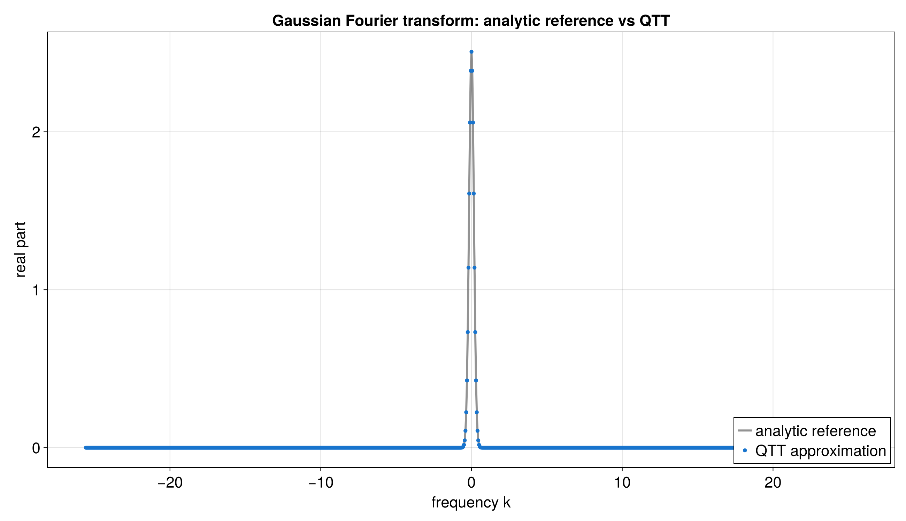

# QTT Fourier transform of a Gaussian with `tensor4all-rs`

This tutorial shows how to build a Quantics Tensor Train, or QTT, for a
Gaussian, apply the built-in quantics Fourier operator, and visualize the
continuous Fourier transform of that sampled Gaussian with Julia and CairoMakie.

The workflow is split into two parts:

1. **Rust** builds the input QTT, applies the Fourier operator, and exports the
   numerical data.
2. **Julia + CairoMakie** reads the CSV files and turns them into plots.

That split keeps the Rust code focused on the tensor logic and keeps plotting
code out of Rust.

## Files in this example

The Rust side lives in:

- [`src/bin/qtt_fourier.rs`](../../src/bin/qtt_fourier.rs)
- [`src/qtt_fourier_common.rs`](../../src/qtt_fourier_common.rs)

The Julia plotting script lives in:

- [`docs/plotting/qtt_fourier_plot.jl`](../plotting/qtt_fourier_plot.jl)

The generated data and plots live in:

- [`docs/data/qtt_fourier_samples.csv`](../data/qtt_fourier_samples.csv)
- [`docs/data/qtt_fourier_bond_dims.csv`](../data/qtt_fourier_bond_dims.csv)
- [`docs/data/qtt_fourier_operator_bond_dims.csv`](../data/qtt_fourier_operator_bond_dims.csv)
- [`docs/plots/qtt_fourier_transform.png`](../plots/qtt_fourier_transform.png)
- [`docs/plots/qtt_fourier_transform.png`](../plots/qtt_fourier_transform.png)
- [`docs/plots/qtt_fourier_bond_dims.png`](../plots/qtt_fourier_bond_dims.png)
- [`docs/plots/qtt_fourier_bond_dims.png`](../plots/qtt_fourier_bond_dims.png)
- [`docs/plots/qtt_fourier_operator_bond_dims.png`](../plots/qtt_fourier_operator_bond_dims.png)
- [`docs/plots/qtt_fourier_operator_bond_dims.png`](../plots/qtt_fourier_operator_bond_dims.png)

## Figures at a glance

### Fourier transform



This figure compares the real part of the discrete Fourier transform of the
sampled Gaussian against the QTT result. For a symmetric Gaussian, the
imaginary part should stay close to zero.

### Bond dimensions


This figure shows the bond-dimension profile of the input Gaussian QTT and the
transformed QTT. It gives a quick sense of how much complexity the Fourier
operator introduces. The dashed gray line shows the simple worst-case envelope
used in the Julia notebook for state-like QTT bond growth.

### Fourier MPO bond dimensions


This figure shows the bond-dimension profile of the Fourier MPO itself. All
bond-dimension plots in this tutorial use a `log2` y-axis so the growth is easy
to compare across examples. The dashed gray line shows the simple worst-case
bond profile used in the Julia notebook as `maximal_bd`, with `2^i` for the
state plot and `4^i` for the MPO plot.

## What the example computes

The target function is:

```text
f(x) = exp(-x^2 / 2)
```

The tutorial uses `bits = 10`, so the Gaussian is sampled on `2^10 = 1024`
points.

The Rust program then:

1. Builds a `DiscretizedGrid` for the input Gaussian on a fixed interval.
2. Builds a QTT approximation with `quanticscrossinterpolate(...)`.
3. Builds the quantics Fourier operator with `quantics_fourier_operator(...)`.
4. Aligns the operator to the Gaussian TreeTN with `align_to_state(...)`.
5. Applies the aligned operator to the Gaussian QTT.
6. Evaluates the transformed tree on the output bins.
7. Writes the comparison data to CSV.
8. Writes the bond dimensions to CSV.
9. Lets Julia turn those CSV files into plots.

The quantics Fourier operator itself produces a discrete Fourier coefficient
sequence. For the tutorial plot, the helper code converts those coefficients to
physical Fourier samples by applying the usual `Δx √N` scaling and a phase
correction for the left endpoint of the input interval. That gives the standard
continuous Gaussian transform on a physical frequency axis.

## Why the code is split into two Rust files

The main Rust file,
[`src/bin/qtt_fourier.rs`](../../src/bin/qtt_fourier.rs),
stays focused on the tutorial flow.

The shared helper file,
[`src/qtt_fourier_common.rs`](../../src/qtt_fourier_common.rs),
contains:

- the Fourier configuration
- the Gaussian target function
- the discrete Fourier reference
- the `DiscretizedGrid` builders
- the QTT construction
- the Fourier operator application
- the Fourier MPO bond profile
- the continuous Fourier rescaling
- the CSV writers

That split keeps the tutorial easy to read and leaves room for later sweep
experiments without forcing the first example to become a mini framework.

## Important Rust API pieces

### `DiscretizedGrid`

This object describes the physical domain for the input and output bins.

Important builder calls in this example:

- `with_bounds(-10.0, 10.0)` for the input Gaussian
- a centered bin range for the output axis
- `include_endpoint(true)`
- `with_variable_names(&["x"])` and `with_variable_names(&["k"])`

### `quanticscrossinterpolate(...)`

This is the main constructor for the QTT in this example.

It takes:

- a `DiscretizedGrid`
- a callback `Fn(&[f64]) -> f64`
- optional starting pivots
- interpolation options

It returns:

- the QTT object
- a rank history
- an error history

### `quantics_fourier_operator(...)`

This constructs the built-in quantics Fourier operator.

The operator works on the same bit-width on both sides. The tutorial then
rescales the discrete output into physical Fourier samples so the plot matches
the analytic Gaussian transform.

### `align_to_state(...)`

This updates the operator's public input and output site-index mappings to
match the TreeTN state produced from the Gaussian QTT. Older examples needed to
replace the state site indices with the operator input indices by hand; the
library now handles that alignment through `LinearOperator::align_to_state`.

### `apply_linear_operator(...)`

This applies the aligned Fourier operator to the input QTT. The call receives
the original state and the aligned operator, so the tutorial code no longer
does manual index matching before application.

### Bit-reversed Fourier output

The quantics Fourier operator still returns coefficients in the QFT
bit-reversed order. That is separate from operator/state site-index alignment:
`align_to_state(...)` removes the need for manual index matching, but the
sampling helper still reverses the quantics bit values when reading
coefficients back on the natural frequency axis.

### Bond-dimension plots

Every bond-dimension plot in this tutorial uses a `log2` y-axis. That keeps
the scale consistent across the QTT and MPO figures and makes exponential-like
growth easier to read. Each bond plot also includes a dashed gray worst-case
envelope.

### `evaluate_at(...)`

This reads a value back out of the transformed TreeTN at specific quantics
indices.

## How to read the plots

### Fourier transform

The first plot compares:

- the analytic continuous Fourier transform of the sampled Gaussian
- the QTT-based Fourier result

The plot focuses on the real part, since the symmetric Gaussian should produce
an output with a very small imaginary part.

### Bond dimensions

The second plot shows the bond-dimension profile of the input and transformed
networks.

Interpretation:

- small values mean the QTT is compact
- larger values mean the internal representation needs more room
- the dashed gray line is the simple worst-case QTT envelope

### Fourier MPO bond dimensions

The third plot shows the bond-dimension profile of the Fourier MPO itself. It
uses the same `log2` y-axis as the other bond plots, and it overlays the
worst-case bond profile from the Julia notebook.

## Julia mapping

The table below gives a rough translation between the Rust and Julia pieces.

| Rust `tensor4all-rs` concept | Role in this tutorial |
|---|---|
| `DiscretizedGrid` | defines the input and output axes |
| `quanticscrossinterpolate(...)` | builds the Gaussian QTT |
| `quantics_fourier_operator(...)` | builds the QFT MPO |
| `align_to_state(...)` | aligns the QFT MPO's site-index mappings to the state |
| `apply_linear_operator(...)` | applies the QFT to the Gaussian state |
| `tree_link_dims(...)` | reads bond dimensions from a TreeTN MPO |
| `evaluate_at(...)` | samples the transformed TreeTN |
| CSV export | hands data to Julia for plotting |

## Running the workflow

1. Build the QTT and write the CSV files:

```bash
cargo run --bin qtt_fourier --offline
```

2. Turn the CSV files into plots:

```bash
julia --project=docs/plotting docs/plotting/qtt_fourier_plot.jl
```

3. Inspect the generated figures in `docs/plots/`.

## Next step

This first version is intentionally small. Later we can add sweeps over `bits`
and the interval choices without changing the overall structure of the helper
module.
