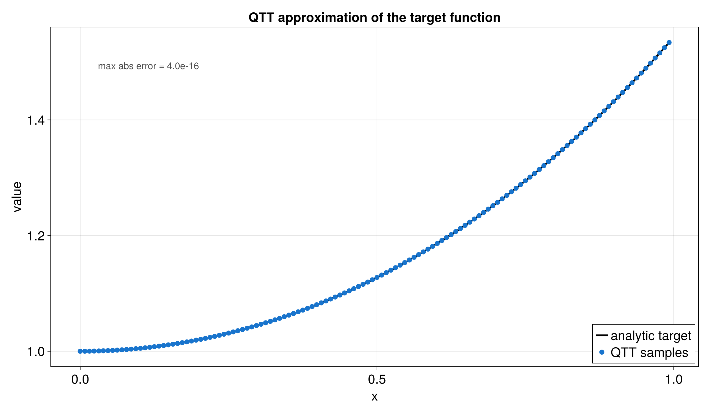
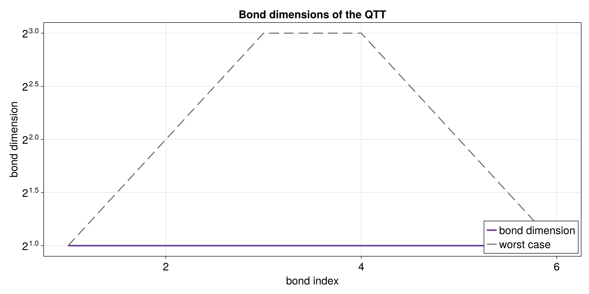

# QTT of a scalar function with `tensor4all-rs` and CairoMakie

This mini project shows a complete and beginner-friendly workflow for building
a Quantics Tensor Train, or QTT, from an analytic function and then visualizing
the result.

The setup is intentionally split into two parts:

1. **Rust** builds the QTT and exports the numerical data.
2. **Julia + CairoMakie** reads the CSV files and creates the plots.

That split keeps the Rust code focused on the algorithm and keeps plotting code
out of Rust.

## Files in this example

The Rust side lives in:
- [`src/bin/qtt_function.rs`](../../src/bin/qtt_function.rs)
- [`src/qtt_function_utils.rs`](../../src/qtt_function_utils.rs)

The Julia plotting script lives in:

- [`docs/plotting/qtt_function_plot.jl`](../plotting/qtt_function_plot.jl)

The generated data and plots live in:

- [`docs/data/qtt_function_samples.csv`](../data/qtt_function_samples.csv)
- [`docs/data/qtt_function_bond_dims.csv`](../data/qtt_function_bond_dims.csv)
- [`docs/plots/qtt_function_vs_qtt.png`](../plots/qtt_function_vs_qtt.png)
- [`docs/plots/qtt_function_vs_qtt.png`](../plots/qtt_function_vs_qtt.png)
- [`docs/plots/qtt_function_bond_dims.png`](../plots/qtt_function_bond_dims.png)
- [`docs/plots/qtt_function_bond_dims.png`](../plots/qtt_function_bond_dims.png)

## Figures at a glance

### Function versus QTT



This figure overlays the analytic function and the reconstructed QTT values.
If the QTT approximation is working well, the sampled points should sit on top
of the curve almost perfectly.

### Bond dimensions



This figure shows the internal bond-dimension profile of the QTT. Smaller
values mean the representation is more compact; larger values mean the QTT
needs more internal room to represent the function. The dashed gray line shows
the simple worst-case QTT envelope.

## What the example computes

The target function is currently

```text
f(x) = cosh(x)
```

You can replace the body of `target_function(x)` in
[`src/bin/qtt_function.rs`](../../src/bin/qtt_function.rs) with any other `f64 -> f64`
function you want to study.

The Rust program then:

1. Defines the analytic function.
2. Builds a QTT approximation with `quanticscrossinterpolate_discrete(...)`.
3. Evaluates the QTT again at all sample points.
4. Writes the comparison data to CSV.
5. Writes the bond dimensions to CSV.
6. Lets Julia turn those CSV files into plots.

## Why the code is split into two Rust files

The main Rust file, [`src/bin/qtt_function.rs`](../../src/bin/qtt_function.rs), now only
contains the parts that are directly about the QTT construction:

- the constants
- the function being approximated
- the interpolation setup

All helper tasks moved into [`src/qtt_function_utils.rs`](../../src/qtt_function_utils.rs):

- sample collection
- CSV writing
- terminal printing
- small indexing utilities

That separation makes the demo easier to read because the mathematical idea is
not mixed with file output and formatting code.

## What `cargo run` does here

When you run:

```bash
cargo run --bin qtt_function --offline
```

Cargo builds the `qtt_function` binary and executes it.

The binary writes the CSV files into `docs/data/`.
After that, the Julia plotting script reads those CSVs and creates the figures.

## Important Rust API pieces

### `quanticscrossinterpolate_discrete`

This is the main constructor for the QTT in this example.

It takes:

- the discrete grid size
- a function callback
- optional starting pivots
- interpolation options

It returns:

- the quantics tensor interpolation object
- a rank history
- an error history

This is the central function to remember if you want to build a QTT from an
analytic function.

### `QtciOptions`

These settings control the interpolation process.

Useful fields in this demo:

- `tolerance`: stop once the approximation is accurate enough
- `maxbonddim`: upper bound on the bond dimension
- `nrandominitpivot`: number of random initial pivots
- `unfoldingscheme`: how the quantics dimensions are arranged

### `evaluate(...)`

This reads a value back out of the QTT.

For example:

```rust
let value = qtci.evaluate(&[17]).unwrap();
```

The discrete API is 1-based, so index `17` means the 17th grid point.

### `link_dims()` and `rank()`

These tell you how large the internal TT bonds are.

- `link_dims()` returns the full bond-dimension profile
- `rank()` returns the largest bond dimension

### `tensor_train()`

This exposes the underlying `TensorTrain` structure.

That is useful when you want to inspect the cores directly.

## How to read the plots

### Function vs QTT

The first plot compares:

- the analytic target function
- the QTT samples read back with `evaluate(...)`

If the QTT approximation is good, the blue markers should sit on top of the
black curve.

### Bond dimensions

The second plot shows the bond dimension profile of the QTT.

This plot uses:

- `lines!` instead of bars
- a `log2` y-axis

That matches the style used in your Julia notebook more closely.

Interpretation:

- small values mean the QTT is compact
- larger values mean the internal representation needs more room

## Julia mapping

The table below gives a rough translation between the Julia notebook idea and
the Rust version.

| Julia notebook concept | Rust `tensor4all-rs` equivalent |
|---|---|
| `fill_array(...)` | the callback passed into `quanticscrossinterpolate_discrete(...)` |
| `QTT(A, R, cut, thresh)` | `quanticscrossinterpolate_discrete(...)` |
| `getvalue(F, i, R)` | `qtci.evaluate(&[i])` |
| `bd` / bond dimension list | `qtci.link_dims()` |
| repeated SVD construction | direct QTT interpolation in the library |
| `unravel_QTT(...)` | `qtci.tensor_train()` |
| plotting inside the notebook | plotting from CSV with Julia + CairoMakie |

## If you have data points instead of a function

You do not need an analytic function.

If you already have sampled data, the common pattern is:

1. Store the sampled values in a vector.
2. Wrap the vector in a lookup closure.
3. Pass that closure to `quanticscrossinterpolate_discrete(...)`.

Sketch:

```rust
let data = vec![/* sampled values */];
let f = |idx: &[i64]| -> f64 {
    let i = (idx[0] - 1) as usize;
    data[i]
};
```

That lets the same QTT machinery work for measured or precomputed values too.

For a different analytic function, you usually only need to change `target_function(x)` and the plot labels.

## Running the workflow

1. Build the QTT and write the CSV files:

```bash
cargo run --bin qtt_function --offline
```

2. Generate the plots with Julia:

```bash
julia --project=docs/plotting docs/plotting/qtt_function_plot.jl
```

The Julia script reads:

- `docs/data/qtt_function_samples.csv`
- `docs/data/qtt_function_bond_dims.csv`

and writes the figures into:

- `docs/plots/`

## Suggested reading order for a beginner

If you want to understand the code slowly, read it in this order:

1. `src/bin/qtt_function.rs`
2. `src/qtt_function_utils.rs`
3. `docs/plotting/qtt_function_plot.jl`
4. this tutorial again with the code open

That order follows the actual data flow:

`analytic function -> QTT construction -> CSV export -> Julia plots`
