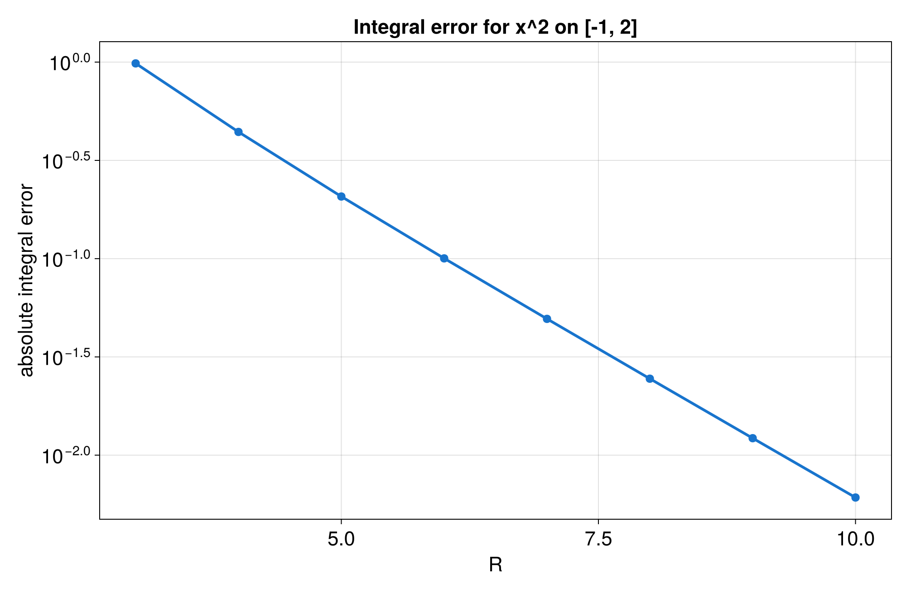

# Definite integrals on a physical interval

This tutorial shows how to compute a definite integral from a QTT built on a
real interval. It uses the same setup as the interval tutorial, then adds one
new library call:

```rust
let integral = qtci.integral()?;
```

The example is intentionally small. We use

```text
f(x) = x^2
```

on the interval

```text
[-1, 2]
```

The exact answer is

```text
integral from -1 to 2 of x^2 dx = 3
```

The code computes that reference value from the antiderivative
`F(x) = x^3 / 3` and the configured interval bounds. That keeps the exact answer
tied to the interval while still keeping this tutorial specific to the function
`x^2`.

## Computing the integral once

The terminal-only example lives in:

- [`src/bin/qtt_integral.rs`](../../src/bin/qtt_integral.rs)
- [`src/qtt_interval_common.rs`](../../src/qtt_interval_common.rs)

Run it with:

```bash
cargo run --bin qtt_integral --offline
```

The program does four things:

1. Builds a `DiscretizedGrid` on `[-1, 2]`.
2. Builds a QTT for `x^2` with `quanticscrossinterpolate(...)`.
3. Calls `integral()` on the QTT.
4. Prints the QTT result, the exact answer, and the absolute error.

In pseudocode, the Tensor4all workflow looks like this:

```text
choose R
choose interval bounds a and b
define f(x)

grid = DiscretizedGrid(bits = R, bounds = [a, b])

qtt = quanticscrossinterpolate(
    grid,
    callback coords -> f(coords[0]),
    interpolation_options,
)

computed_integral = qtt.integral()
known_or_reference_integral = exact answer, high-resolution reference, or benchmark
absolute_error = abs(computed_integral - known_or_reference_integral)

print computed_integral
print absolute_error
```

For this tutorial, those placeholders become:

```text
R = 7
a = -1
b = 2
f(x) = x^2
known_or_reference_integral = 3
```

`DiscretizedGrid` is the object that connects tensor indices to physical
coordinates. Without it, the QTT only knows about integer grid points. With it,
the callback receives real coordinates, so the function can be written in the
natural form:

```rust
pub fn interval_target(x: f64) -> f64 {
    x * x
}
```

The interval `[-1, 2]` is useful because it is still simple, but it is no longer
the default unit interval. That makes it a good first check that the grid really
is carrying the physical bounds.

The function `x^2` is a friendly first example because it is smooth, familiar,
and has an exact integral that is easy to verify by hand. If the computed value
is close to `3.0`, the QTT, the grid spacing, and `integral()` are all working
together.

In practice, `integral()` evaluates the integral represented by the discretized
QTT. For this finite grid, that means the result is a grid-based approximation
to the analytic integral, not symbolic calculus.

## Convergence over `R`

The sweep example lives in:

- [`src/bin/qtt_integral_sweep.rs`](../../src/bin/qtt_integral_sweep.rs)
- [`src/qtt_integral_sweep_utils.rs`](../../src/qtt_integral_sweep_utils.rs)
- [`docs/plotting/qtt_integral_sweep_plot.jl`](../plotting/qtt_integral_sweep_plot.jl)

Run the Rust sweep with:

```bash
cargo run --bin qtt_integral_sweep --offline
```

It repeats the same interval setup for several values of `R`. Each `R` gives a
grid with:

```text
N = 2^R
```

For each row, the sweep records:

- `R`
- number of grid points
- computed integral
- exact integral
- absolute error
- QTT rank

The CSV is written to:

- [`docs/data/qtt_integral_sweep.csv`](../data/qtt_integral_sweep.csv)

Then generate the plot with:

```bash
julia --project=docs/plotting docs/plotting/qtt_integral_sweep_plot.jl
```

The Julia script writes:

- [`docs/plots/qtt_integral_sweep.png`](../plots/qtt_integral_sweep.png)
- [`docs/plots/qtt_integral_sweep.png`](../plots/qtt_integral_sweep.png)

### Integral error plot



The sweep exists only to build intuition. As `R` grows, the grid has more
points on the same physical interval, so the grid-based integral has a chance
to get closer to the exact value.

## What this tutorial does not cover

This page is only about `integral()`.

The lower-level `sum()` method is not part of the core lesson here. It is useful
for other workflows, but for a beginner asking for a physical definite integral,
`integral()` is the method to focus on.

For the interval construction and function sampling plots, read:

- [`docs/tutorials/qtt_interval_tutorial.md`](qtt_interval_tutorial.md)

For the new integral code, read the files in this order:

1. [`src/qtt_interval_common.rs`](../../src/qtt_interval_common.rs)
2. [`src/bin/qtt_integral.rs`](../../src/bin/qtt_integral.rs)
3. [`src/bin/qtt_integral_sweep.rs`](../../src/bin/qtt_integral_sweep.rs)
4. [`docs/plotting/qtt_integral_sweep_plot.jl`](../plotting/qtt_integral_sweep_plot.jl)
