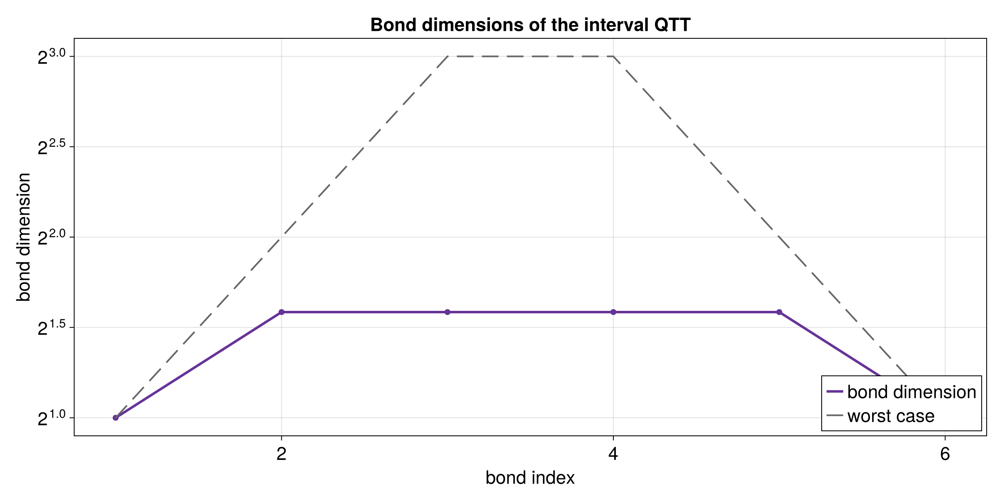

# QTT on a physical interval with `tensor4all-rs`

This tutorial shows how to build a Quantics Tensor Train, or QTT, for a
function on a real interval instead of only on a discrete `[0, 1]` grid.

The first version is intentionally small:

- the target function is `x^2`
- the interval is fixed to `[-1, 2]`
- the QTT is built with `DiscretizedGrid`
- the Rust code exports CSV files
- Julia + CairoMakie turns those CSV files into plots

The definite integral tutorial is separate. This one is only about getting the
interval setup right and checking that the QTT tracks the analytic curve.

## Files in this example

The Rust side lives in:

- [`src/bin/qtt_interval.rs`](../../src/bin/qtt_interval.rs)
- [`src/qtt_interval_common.rs`](../../src/qtt_interval_common.rs)
- [`src/qtt_interval_utils.rs`](../../src/qtt_interval_utils.rs)

The Julia plotting script lives in:

- [`docs/plotting/qtt_interval_plot.jl`](../plotting/qtt_interval_plot.jl)

The generated data and plots live in:

- [`docs/data/qtt_interval_samples.csv`](../data/qtt_interval_samples.csv)
- [`docs/data/qtt_interval_bond_dims.csv`](../data/qtt_interval_bond_dims.csv)
- [`docs/plots/qtt_interval_function_vs_qtt.png`](../plots/qtt_interval_function_vs_qtt.png)
- [`docs/plots/qtt_interval_function_vs_qtt.png`](../plots/qtt_interval_function_vs_qtt.png)
- [`docs/plots/qtt_interval_bond_dims.png`](../plots/qtt_interval_bond_dims.png)
- [`docs/plots/qtt_interval_bond_dims.png`](../plots/qtt_interval_bond_dims.png)

## Figures at a glance

### Function versus QTT


This figure overlays the analytic function `x^2` with the QTT samples on the
physical interval `[-1, 2]`. The points should sit right on the curve when the
interpolation is working well.

### Bond dimensions



This figure shows the internal bond-dimension profile of the interval QTT.
Smaller values mean the representation is more compact; larger values mean the
QTT needs more internal room to represent the function. The dashed gray line
shows the simple worst-case QTT envelope.

## What the example computes

The target function is:

```text
f(x) = x^2
```

The interval bounds are stored in the shared Rust helper:

- lower bound = `-1.0`
- upper bound = `2.0`

The Rust program then:

1. Builds a `DiscretizedGrid` on `[-1, 2]`.
2. Calls `quanticscrossinterpolate(...)` with a callback that receives
   physical coordinates as `&[f64]`.
3. Evaluates the resulting QTT back on the grid points.
4. Writes the comparison data to CSV.
5. Writes the bond dimensions to CSV.
6. Lets Julia turn those CSV files into plots.

## Why `DiscretizedGrid` matters

In the earlier tutorial, the QTT callback worked on discrete grid indices.
Here, the callback works on real coordinates instead:

```rust
let f = |coords: &[f64]| coords[0] * coords[0];
```

That means the grid itself is responsible for mapping the interval `[-1, 2]`
into quantics coordinates. This is the first step toward physics-style use
cases where the domain is not just a unit interval.

## How the Rust code is split

The main Rust file,
[`src/bin/qtt_interval.rs`](../../src/bin/qtt_interval.rs),
stays focused on the tutorial flow.

The shared helper file,
[`src/qtt_interval_common.rs`](../../src/qtt_interval_common.rs),
contains:

- the interval constants
- the target function
- the `DiscretizedGrid` builder
- the call to `quanticscrossinterpolate(...)`

The output helper file,
[`src/qtt_interval_utils.rs`](../../src/qtt_interval_utils.rs),
handles the support work:

- collecting sample values
- extracting bond dimensions
- printing a readable summary
- writing CSV files

That split keeps the interval setup reusable for the integral tutorial without
mixing the mathematical idea with file output and formatting code.

## Important Rust API pieces

### `DiscretizedGrid`

This object describes the physical domain. In this tutorial it maps the
interval `[-1, 2]` to a quantics grid.

Important builder calls in this example:

- `with_bounds(-1.0, 2.0)`
- `include_endpoint(true)`
- `with_variable_names(&["x"])`

### `quanticscrossinterpolate(...)`

This is the main constructor for the QTT in this example.

It takes:

- a `DiscretizedGrid`
- a callback `Fn(&[f64]) -> f64`
- optional starting pivots
- interpolation options

It returns:

- the QTT object
- a rank history
- an error history

### `evaluate(...)`

This reads a value back out of the QTT at a grid index.

For example:

```rust
let value = qtci.evaluate(&[17]).unwrap();
```

### `link_dims()` and `rank()`

These tell you how large the internal TT bonds are.

- `link_dims()` returns the full bond-dimension profile
- `rank()` returns the largest bond dimension

### `tensor_train()`

This exposes the underlying `TensorTrain` structure.

That is useful when you want to inspect the cores directly.

## How to read the plots

### Function vs QTT

The first plot compares:

- the analytic target function
- the QTT samples read back with `evaluate(...)`

If the QTT approximation is good, the blue markers should sit on top of the
gray curve.

### Bond dimensions

The second plot shows the bond-dimension profile of the QTT.

Interpretation:

- small values mean the QTT is compact
- larger values mean the internal representation needs more room

## Julia mapping

The table below gives a rough translation between the Julia notebook idea and
the Rust version.

| Julia notebook concept | Rust `tensor4all-rs` equivalent |
|---|---|
| `grid` definition | `DiscretizedGrid::builder(...)` |
| function on physical coordinates | callback passed to `quanticscrossinterpolate(...)` |
| `getvalue(F, i, R)` | `qtci.evaluate(&[i])` |
| `bd` / bond dimension list | `qtci.link_dims()` |
| repeated SVD construction | direct QTT interpolation in the library |
| `unravel_QTT(...)` | `qtci.tensor_train()` |
| plotting inside the notebook | plotting from CSV with Julia + CairoMakie |

## A note on sampled data

This first tutorial stays function-based on purpose. If you already have data
points instead of an analytic formula, you can still use the same QTT
machinery, but the lookup rule for converting coordinates to sample indices is a
separate topic and is easier to introduce later.

## Running the workflow

1. Build the QTT and write the CSV files:

```bash
cargo run --bin qtt_interval --offline
```

2. Generate the plots with Julia:

```bash
julia --project=docs/plotting docs/plotting/qtt_interval_plot.jl
```

The Julia script reads:

- `docs/data/qtt_interval_samples.csv`
- `docs/data/qtt_interval_bond_dims.csv`

and writes the figures into:

- `docs/plots/`

## Suggested reading order for a beginner

If you want to understand the code slowly, read it in this order:

1. `src/bin/qtt_interval.rs`
2. `src/qtt_interval_common.rs`
3. `src/qtt_interval_utils.rs`
4. `docs/plotting/qtt_interval_plot.jl`
5. this tutorial again with the code open
